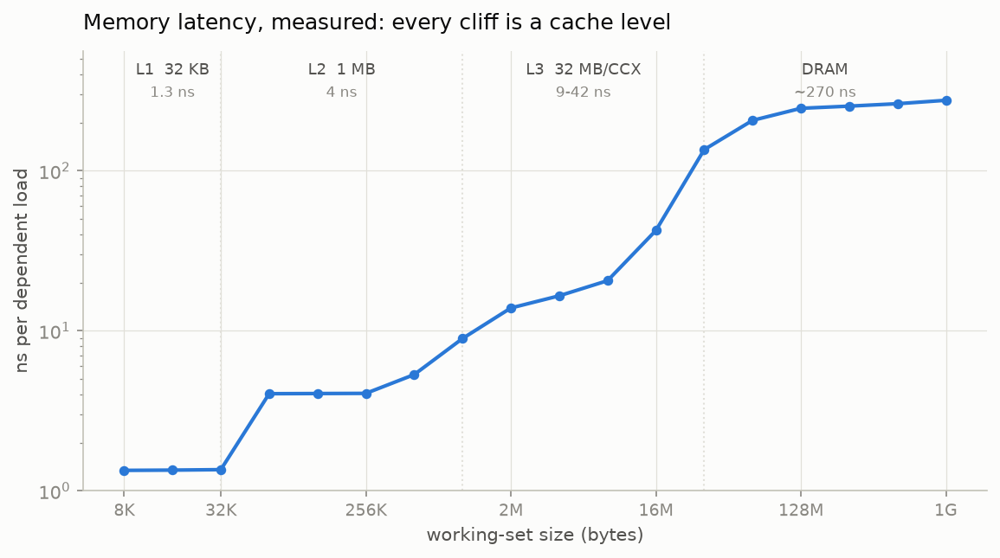
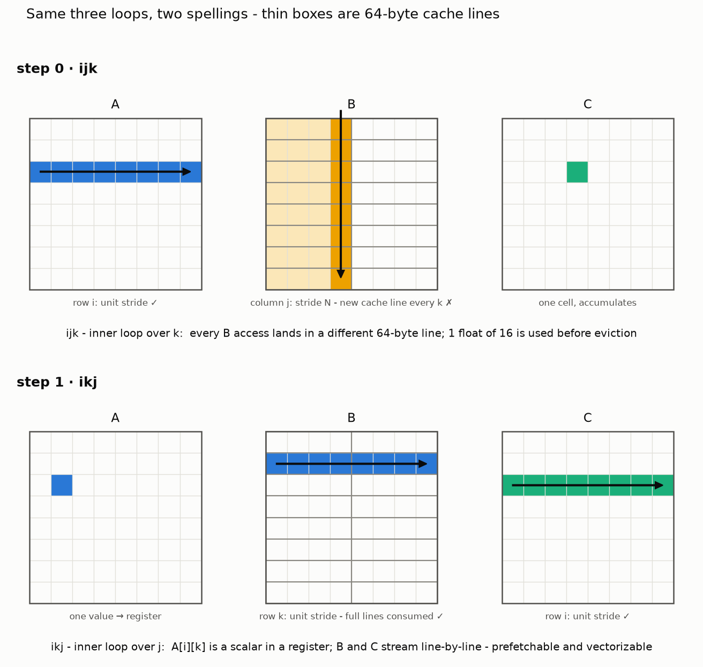
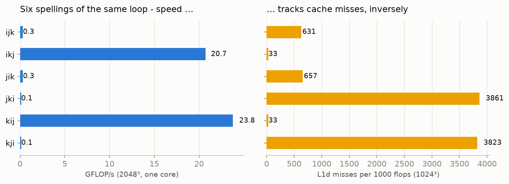
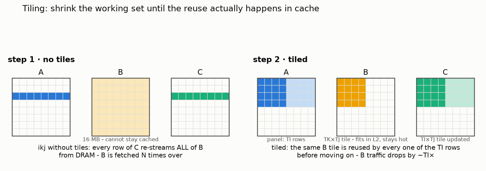
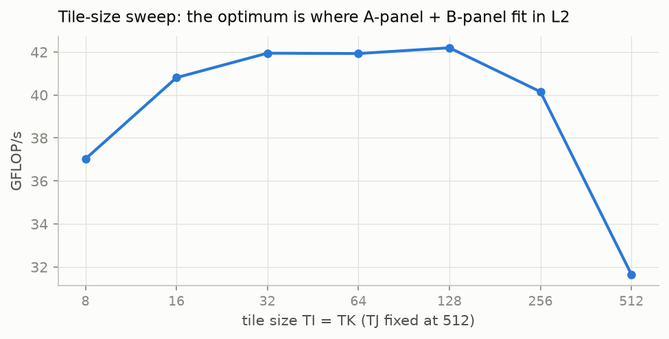
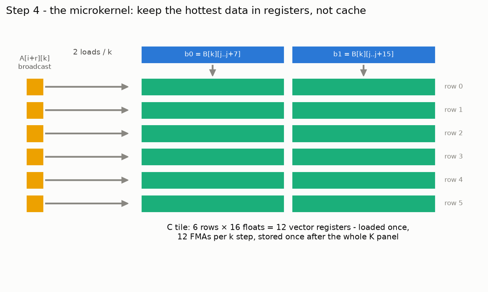
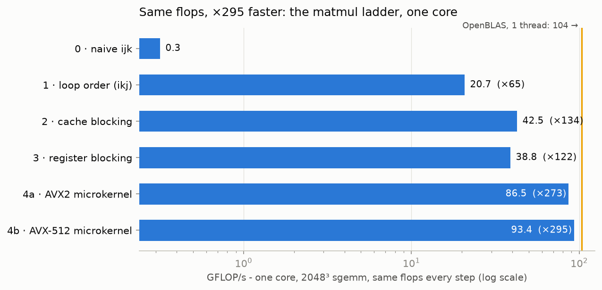
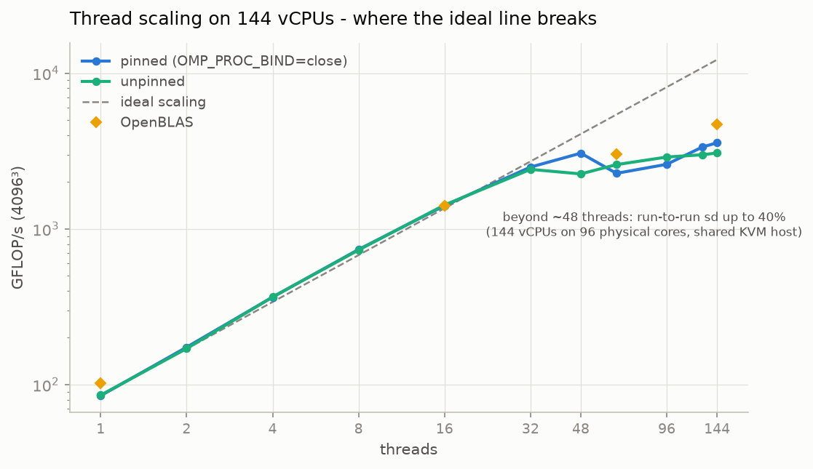

*Every kernel in this post computes the exact same 17 billion floating-point
operations on the same matrices. The fastest single-core version runs
**295× faster** than the slowest - without removing a single flop. This is a
tour of where that factor lives: the cache hierarchy, and loops that respect
it.*

---

Take the matrix multiplication everyone writes first - three nested loops -
and run it on a modern server core (AMD EPYC 9454, Zen 4): **0.32 GFLOP/s**.
One 2048³ multiply takes 54 seconds. The same core, running code with the
same flops but a different memory choreography, does it in 0.18 seconds.
Nothing in the naive loop is "wrong": the flops are the flops. What's wrong
is the order the bytes are asked to arrive in - and on a CPU, byte order is
nearly everything.

We'll climb there one step at a time, measuring each step (GFLOP/s *and*
hardware cache-miss counters), on one pinned core of a 144-vCPU box, gcc 13
with `-O3 -march=native` throughout - so every speedup you'll see comes from
code structure, not compiler flags.

## Your CPU is a memory device that occasionally computes

A core computes only from **registers**: the FMA units can retire 32
single-precision flops per cycle, but only on operands already in hand.
Everything else is a supply chain, and you should know its prices. Not from
a textbook - measured on this exact machine, with a pointer-chase
microbenchmark (each load's address depends on the previous load, so nothing
can be overlapped or prefetched - pure latency):



| level | size (measured) | latency (measured) |
|---|---|---|
| L1d | 32 KB | **1.3 ns** (~5 cycles) |
| L2 | 1 MB | **4 ns** |
| L3 | 32 MB per 8-core complex | **9-42 ns** |
| DRAM | - | **~270 ns** |

Two things worth pausing on. First, the spread: DRAM costs **~200× more
than L1** per dependent access. Second: this VM's `lscpu` reports fictional
cache sizes (KVM guests often do - it claims 64 KB of L1 and a "2.3 GiB
L3"). The staircase doesn't lie; the cliffs sit exactly at Zen 4's real
32 KB / 1 MB / 32 MB boundaries. Measure, don't trust.

Streaming bandwidth tells the other half: one core pulls about **14 GB/s**
from DRAM, and all 144 threads together top out near **290 GB/s** - 144×
the compute, but only 21× the bandwidth. Cores multiply; the memory bus
doesn't. Keep that asymmetry in mind for the threading steps later.

## Why matmul is the perfect specimen

`C = A·B` at 2048³ does 2·2048³ ≈ 17.2 GFLOP on 48 MB of matrices. That's
the interesting property: **O(N³) work on O(N²) data** - each element of A
and B is *needed* 2048 times. Whether it's *fetched* from DRAM 2048 times or
twice is entirely up to the loop structure. Arithmetic intensity - flops per
byte moved - is not fixed by the algorithm; it's chosen by the
implementation. Naive code chooses ~1 flop/byte and inherits the memory
system's speed. Blocked code chooses hundreds and inherits the FMA units'.

So the entire post is one sentence: **move each byte up the hierarchy once,
then use it many times before letting it fall back down.**

## Step 0 - the loop everyone writes first

```c
for (int i = 0; i < M; i++)
  for (int j = 0; j < N; j++)
    for (int k = 0; k < K; k++)
      C[i*N + j] += A[i*K + k] * B[k*N + j];
```

**0.32 GFLOP/s.** The killer is `B[k*N + j]` with `k` innermost: consecutive
iterations touch B one full row apart - an 8 KB stride. Every access opens a
fresh 64-byte cache line, uses **4 bytes** of it, and the line is evicted
long before the next column pass could reuse it. The counters agree: **42%
of all L1 loads miss**. And there's a second, quieter penalty: a
strided reduction is something the compiler can't vectorize, so this runs as
scalar code on a machine with 16-lane FMA units.

## Step 1 - same flops, different spelling

Three loops permute six ways. Same arithmetic, same result - six different
access patterns. Here's what the two extreme spellings ask the cache to do:



In `ikj` (bottom), `A[i][k]` becomes a scalar parked in a register, and both
B and C stream left-to-right through consecutive cache lines: every byte
fetched is a byte used, the prefetcher recognizes the sequential walk and
runs ahead, and the inner loop is exactly the shape the compiler knows how
to vectorize.

```c
for (int i = 0; i < M; i++)
  for (int k = 0; k < K; k++) {
    float a = A[i*K + k];            // scalar, reused across the j loop
    for (int j = 0; j < N; j++)
      C[i*N + j] += a * B[k*N + j];  // unit stride through B and C
  }
```

**20.7 GFLOP/s - ×65 from swapping two lines.** All six orders, measured:



| inner loop | orders | GFLOP/s | L1 misses / kflop | IPC |
|---|---|---|---|---|
| `j` (unit stride) | ikj, kij | 20.7 / 23.8 | **33** | 1.8 |
| `k` (B strided) | ijk, jik | 0.32 / 0.32 | 631 | 0.6 |
| `i` (A *and* C strided) | jki, kji | **0.13** | 3,861 | 0.15 |

The orders pair *exactly* by their inner loop - the outer order barely
matters. And notice the instruction counts hiding in the IPC column: the
`j`-inner versions execute **18× fewer instructions** for the same flops
(481M vs 8.7B), because the compiler vectorized them. Access pattern and
vectorizability aren't two separate optimizations; the same loop shape buys
you both - or costs you both. The worst order, `jki`, strides through *two*
arrays at once and manages 2.7 misses per load: at 2048³ it runs **135
seconds** - the same flops `ikj` finishes in 0.83.

## Step 2 - tiling: make the working set fit

`ikj` fixed the *shape* of each access, but not the *amount* of reuse: by
the time row `i+1` wants the same rows of B again, all 16 MB of B have
marched through the cache and evicted themselves. The reuse the algorithm
promises never physically happens.



Tiling is the fix: break the loops into blocks so a `TK×TJ` tile of B *fits
in L2 and stays there* while a `TI`-row panel of A sweeps over it. Each B
byte is fetched from DRAM once per tile pass instead of once per C row:

```c
for (int ii = 0; ii < M; ii += TI)     // block the loops...
  for (int kk = 0; kk < K; kk += TK)
    for (int jj = 0; jj < N; jj += TJ)
      /* ...then run ikj inside the (TI × TK × TJ) block */
```

**42.5 GFLOP/s (×134).** And the tile-size sweep is the hierarchy speaking
directly: performance plateaus while the B tile + A panel fit in the 1 MB
L2, and falls off a cliff (-25%) at `TI = 512`, where the tile alone is
1 MB:



## Step 3 - a humbling interlude: the compiler was already here

The next classical step is *register blocking*: compute a small tile of C
in local variables so each loaded value feeds multiple accumulations. I
wrote the textbook version - a 4×16 C tile in plain C, j-loop innermost so
it stays vectorizable - and measured… **38.8 GFLOP/s. A wash with step 2.**

Two honest lessons from this step. First: my *initial* version used the
other textbook formulation (4×4 tile, dot-product style, k innermost) and
ran **4× slower than step 2** - a k-inner reduction with strided B kills
auto-vectorization, same as step 0. Register blocking that breaks
vectorization is negative-value work. Second: once the loop *is*
vectorizable, gcc at `-O3 -march=native` was already register-blocking it
behind your back - the plain-C hint adds nothing. The compiler got us to 42.
To go further you can't hint; you have to *say what you mean*.

## Step 4 - SIMD: say what you mean



The microkernel pins a 6×16 tile of C in **12 vector registers for the
entire K panel**. Per k step: two loads pull a slice of B's row, six
broadcasts pull a column sliver of A, twelve FMAs update the tile. C touches
memory exactly twice - one load, one store - regardless of K. The innermost
loop now does 12 FMAs per 2 loads; the FMA units, not the cache, become the
bottleneck. That inversion - compute-bound at last - is the point of the
whole ladder.

```c
__m256 c[6][2];                       // the C tile: 12 ymm registers
for (int k = 0; k < kc; k++) {
  __m256 b0 = _mm256_loadu_ps(B + k*N);        // 2 loads
  __m256 b1 = _mm256_loadu_ps(B + k*N + 8);
  for (int r = 0; r < 6; r++) {
    __m256 a = _mm256_set1_ps(A[r*K + k]);     // broadcast
    c[r][0] = _mm256_fmadd_ps(a, b0, c[r][0]); // 12 FMAs
    c[r][1] = _mm256_fmadd_ps(a, b1, c[r][1]);
  }
}
```

**AVX2: 86.5 GFLOP/s (×273). AVX-512 (same kernel, zmm registers): 93.4
(×295)** - 79% of this core's theoretical FP32 peak, and within 10% of
OpenBLAS single-threaded (103.6). The counters close the loop on the story:
misses per kflop fell from 631 (step 0) to **7**, and the AVX-512 version
retires the same work in 190M instructions - 46× fewer than the naive loop.
(Zen 4 "double-pumps" 512-bit ops through 256-bit units, so AVX-512's edge
here is register count and fewer instructions, not raw FLOP rate.)



### Aside: "did you try unrolling?"

Explicitly, yes - and it's a good example of an optimization whose moment has
passed by this point on the ladder. Unrolling pays when a loop is limited by
branch overhead or doesn't expose enough independent work; it does nothing
when the execution units are already saturated. Measured: `-funroll-loops`
speeds up the *naive* vectorizable loop by +27% (step 1 material), is flat on
the tiled loops, and makes the intrinsics kernels *slower* (-16% on the AVX2
one - bigger loop body, no bottleneck removed). Manually unrolling the
AVX-512 microkernel's k loop by 4 (`avx512u` in the repo): -4%. The
microkernel already keeps 12 independent FMA chains in flight, and the
register tile itself *is* an unroll of the i and j loops - the technique is
baked into steps 3 and 4, so applying it again just adds bytes to the loop
body.

## Step 5 - threads: many cores, one memory bus

Parallelizing a blocked matmul looks trivial - C's rows are independent, so
hand each thread a slice. My first version handed out slices of **6 rows**
(one microtile) for load balance… and single-thread throughput collapsed
from 93 to **19 GFLOP/s**. Why: inside each tiny slice, every B tile gets
loaded, used for just 6 rows, and evicted - the decomposition had quietly
destroyed step 2. The fix is one contiguous row-panel per thread, so each
thread keeps the full single-core blocking structure. **Thread decomposition
is a cache decision before it's a scheduling decision.**



With that fixed, scaling at 4096³ is near-ideal up to 48 threads: ×16.6 at
16 threads (1.41 TFLOP/s), **×36 at 48 (3.06 TFLOP/s)**. Beyond that the
curve goes flat and *noisy* - run-to-run deviation reaches 40% - and that's
its own lesson: this is a 144-vCPU guest on 96 physical cores of a shared
hypervisor. Past the physical core count you're not benchmarking your code
anymore; you're benchmarking the host's scheduler. (OpenBLAS, same
conditions, peaks at 4.7 TFLOP/s - the gap to us is packing plus a smarter
2-D decomposition, and it rides the same noise.)

## Step 6 - pinning: stop moving my caches

Everything on this ladder lives in **per-core** caches - and by default the
OS scheduler feels free to bounce threads between cores, restarting L1 and
L2 from zero on every migration. The scaling plot shows both variants: with
`OMP_PROC_BIND=close OMP_PLACES=cores` versus letting threads float. The
clearest read is at 48 threads: **pinned 3065 GFLOP/s with 0.1% deviation;
unpinned 2255 with 28%**. Pinning didn't just add a third - it made the
number *repeatable*. If you benchmark anything multithreaded without
pinning, you're sampling a distribution and calling it a measurement.

On a bare-metal multi-socket box this step grows teeth: memory pages live on
the socket that first touched them (**first-touch policy**), so an unpinned
thread can end up doing every load across the socket interconnect. That's
the NUMA story - same principle as everything above, one level further out:
*keep the data next to the compute*. This VM exposes a single NUMA node, so
what remains visible here is the affinity half.

## The ceiling: what OpenBLAS still knows that we don't

Single-core, our AVX-512 kernel reaches 90% of OpenBLAS. The remaining
10% - and the ~30% gap at full-chip scale - is what a production BLAS adds:
**packing** (copying each tile into a contiguous buffer once, so the
microkernel reads pure unit-stride with no TLB pressure), per-µarch tuned
tile shapes and prefetch distances, and a thread decomposition where cores
*share* packed panels instead of each re-streaming B from DRAM. None of it
is magic; all of it is more of the same idea - move each byte once, use it
many times.

## Takeaways

- **The flops never changed.** From 0.13 to 93 GFLOP/s on one core - a
  ×735 spread - purely by changing the order bytes move. On CPUs, matmul is
  a memory problem long before it's an arithmetic one.
- **The hierarchy is measurable, and worth measuring.** 1.3 ns → 4 → 9-42 →
  ~270: each step of the ladder exists to keep the working set one level
  higher. (And in a VM, the measurement beats the spec sheet - `lscpu` was
  wrong about every cache size.)
- **Access pattern is the ×65 decision** - and it's free. Loop order
  determines stride, prefetchability, *and* vectorizability at once. Check
  it before anything else.
- **The compiler gets you to the L2 step, not past it.** Auto-vectorization
  matched my hand-written register blocking - but the explicit microkernel
  doubled it. Registers are the one level of the hierarchy the compiler
  won't fully manage for you.
- **Threads scale what you give them.** A decomposition that broke the
  blocking cost 5× before a single lock or false-share entered the picture;
  with blocking preserved, 48 threads gave ×36. And past the physical core
  count on a shared VM, variance (up to 40%) *is* the measurement - pin your
  threads and report deviations.

This ladder - access order, tiling, register microkernels, panel sharing -
is exactly the anatomy of every fast GEMM in the wild, from OpenBLAS to the
quantized matmul kernels inside llama.cpp. Next time a library README
brags about GFLOP/s, you'll know which step they're standing on.

---

*Reproduce:
[github.com/nguyenhoangthuan99/optimization-diaries](https://github.com/nguyenhoangthuan99/optimization-diaries) -
`make && scripts/run_ladder.sh 2048` (gcc 13, `-O3 -march=native`).
Measured on one AMD EPYC 9454 (Zen 4) KVM guest, Ubuntu 24.04; single-core
runs pinned with `taskset`, medians of 3-5 runs, raw logs in
[`data/`](https://github.com/nguyenhoangthuan99/optimization-diaries/tree/main/data).*
