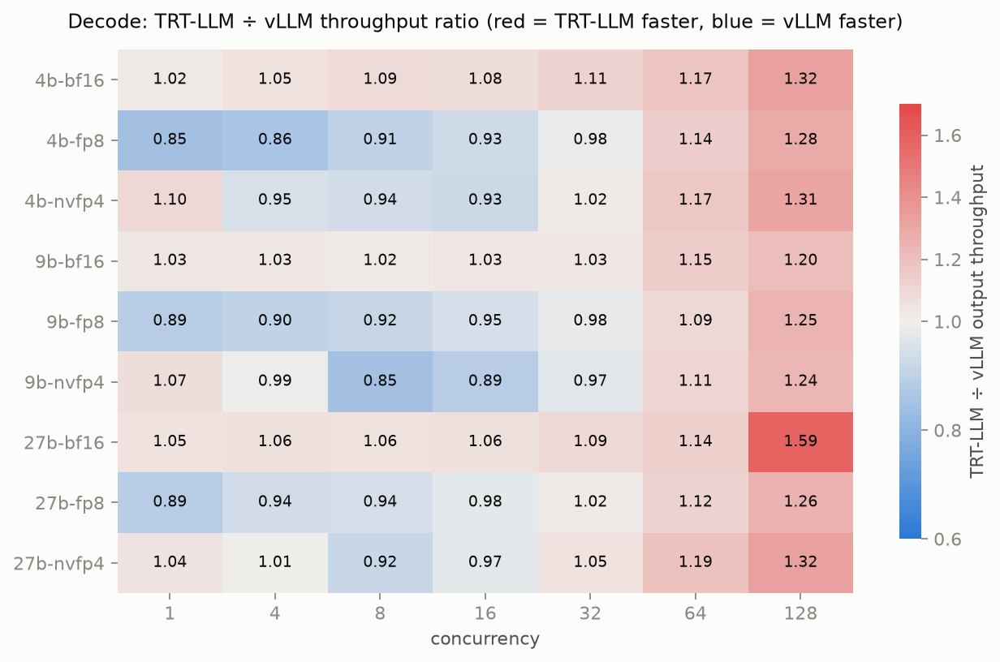
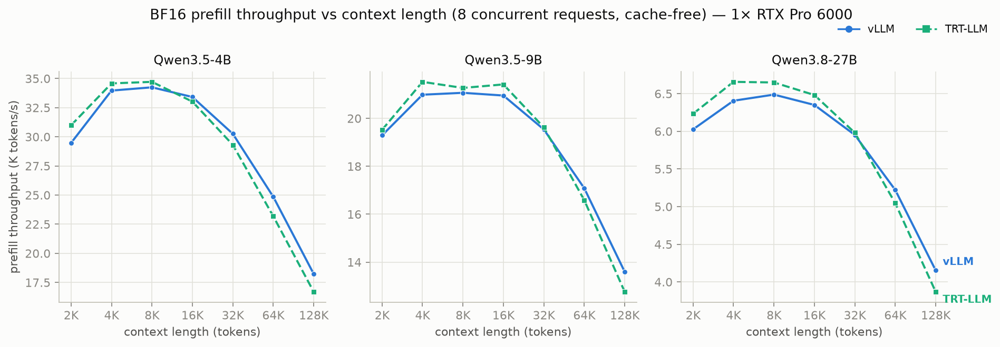
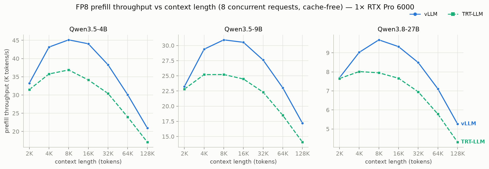
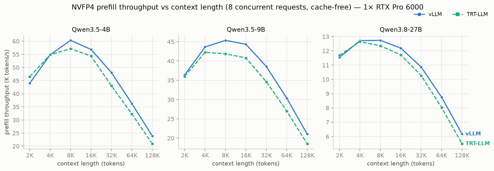
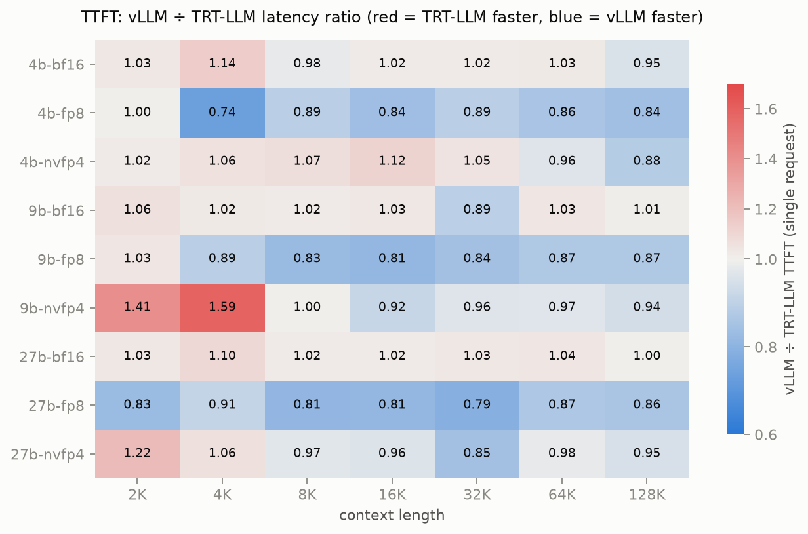

*Three models (4B, 9B, 27B), three precisions (BF16, FP8, NVFP4), two engines
(vLLM and TensorRT-LLM), one 96 GB RTX Pro 6000 Blackwell. About 1,300
measured cells across decode and prefill sweeps. The result is not "engine X
wins" - it's a map of which engine wins **where**, plus a weight-loader patch
TensorRT-LLM needed before it could play at all.*

---

The RTX Pro 6000 Blackwell is an interesting serving target: 96 GB of VRAM,
native NVFP4 tensor cores, workstation pricing - and an architecture (SM120)
that is *not* the datacenter Blackwell. SM100 kernels don't run on it: it has
99 KB of shared memory per SM instead of 228 KB and lacks `tcgen05.mma`, so
every "Blackwell-optimized" kernel an engine ships for B200 has to be
re-ported. That makes "which engine is faster" a genuinely open question on
this card, and for the model family we test here, nobody had published
numbers at all.

## The setup

**Models.** One family, three sizes, so the scaling story is clean:
Qwen3.5-4B, Qwen3.5-9B, and Qwen3.8-27B. All three are *hybrid linear
attention* models - 3 of every 4 layers use gated-DeltaNet-style linear
attention with constant-size state, only the remaining quarter are ordinary
full attention. This matters twice: the KV cache stays small at long
contexts, and the unusual architecture stresses each engine's least-tested
code paths.

**Precisions.** Each size in three flavors:

| | BF16 | FP8 | NVFP4 |
|---|---|---|---|
| 4B | Qwen/Qwen3.5-4B | lovedheart/Qwen3.5-4B-FP8 | AxionML/Qwen3.5-4B-NVFP4 |
| 9B | Qwen/Qwen3.5-9B | lovedheart/Qwen3.5-9B-FP8 | AxionML/Qwen3.5-9B-NVFP4 |
| 27B | Qwen/Qwen3.8-27B | Qwen/Qwen3.8-27B-FP8 (official) | Inferact/Qwen3.8-27B-NVFP4 |

The NVFP4 checkpoints are ModelOpt-format on purpose - it's the one
quantized format both engines can load.

**Engines.** vLLM (recent dev build, `vllm/vllm-openai` image) and TensorRT-LLM
**1.3.0rc25**. The RC is not optional: stable TRT-LLM (1.2.1) does not know
this model architecture at all - Qwen3.5/3.8 support landed only in the
1.3.0 release-candidate line. Two more things worth knowing if you last
touched TRT-LLM a year ago: since 1.2 the TensorRT engine backend is *gone* -
there is no `trtllm-build`, no engine files; the PyTorch backend is the only
backend and `trtllm-serve` loads HuggingFace checkpoints directly. And NVIDIA
still doesn't list this GPU in the officially-tested hardware matrix.

**Matched configs.** Both engines: max batch 128, in-flight token budget
8192 (vLLM `--max-num-batched-tokens` = TRT-LLM `max_num_tokens`, both with
chunked prefill), max sequence length 136K, 90% GPU memory fraction, prefix
caching **off** (see the measurement notes at the end), no speculative decoding, no MTP. One
GPU, one model instance, same benchmark client
(`vllm bench serve`, random dataset, `--ignore-eos`) for both engines.

## What it took to get TensorRT-LLM running

BF16 and FP8 served out of the box (on the RC). Every NVFP4 checkpoint
crashed on load with `IndexError: tuple index out of range` deep in TRT-LLM's
Qwen3.5 weight mapper.

The cause is small and very fixable. ModelOpt NVFP4 checkpoints store two
0-dimensional scalars per quantized linear - `input_scale` and
`weight_scale_2` - alongside the packed weights. The hybrid models store
attention QKV fused in one tensor, and TRT-LLM's weight mapper splits each
fused tensor into separate Q, K, V by slicing dim 0. For the block-scale
tensors it has a dedicated path; for the per-tensor scalars it falls into the
generic splitter, which asks for `tensor.shape[0]` of a tensor whose shape is
`()`.

The patch is ~20 lines: when splitting, a 0-dim scalar is replicated to
Q/K/V (numerically exact - it's the same scale); when re-fusing into
TRT-LLM's packed layout, identical replicas collapse back to one scalar
(we assert they match, and they always did). With that mapper patched, all
nine NVFP4 configurations load and serve. We validated correctness beyond
"looks coherent": on 100 prompts, the first greedy token from patched
TRT-LLM matches vLLM serving the same checkpoint 87% of the time, versus a
99% BF16 cross-engine baseline - and every disagreement is a low-margin tie
(its/the, taking/reading), the signature of quantization noise through two
different kernel stacks rather than mis-applied scales. To our knowledge
these are the first published TRT-LLM numbers for this model family on
SM120.

One more thing we learned checking this against NVIDIA's own checkpoints:
the official `nvidia/*-NVFP4` exports of this family quantize *only the MoE
expert MLPs* - attention and GDN projections stay BF16, which is why
upstream never hit this code path. The community checkpoints we benchmark
quantize attention too: smaller and faster, but a more aggressive recipe
than NVIDIA's own.

## Decode: TRT-LLM owns saturated batch, vLLM owns the FP8 mid-range

Each cell: fixed 128-token prompt, forced 2048-token generation, one wave of
N concurrent requests, N from 1 to 128. (Output lengths 512-8192 were also
swept; TPOT is flat across them, as expected with a constant-size linear
attention state and small full-attention KV.)

One heatmap summarizes all 63 head-to-head decode cells - the ratio of
TRT-LLM to vLLM output throughput (red: TRT-LLM ahead, blue: vLLM ahead):



Three patterns, consistent across all three model sizes:

1. **At saturated batch (c=128), TRT-LLM wins everywhere: +20% to +59%.**
   The gap is quant-independent and grows with model size (27B BF16: 2,063
   vs 1,301 tok/s). Since the kernels are near-tied at batch 1, this is
   runtime - scheduler and batching machinery - not math.
2. **In the low-to-mid range, vLLM wins wherever FP8 is involved**
   (up to +18% single-stream: 197 vs 167 tok/s on 4B). Its FP8 GEMM path on
   SM120 is simply better. On BF16 and NVFP4 the engines are within a few
   percent until c=32, with TRT-LLM slightly ahead single-stream.
3. **NVFP4 is the fastest precision on both engines at every size and every
   concurrency.** Over BF16, single-stream: +73% (vLLM 4B) to +105%
   (vLLM 27B). The bigger the model, the more the 4-bit weights pay -
   decode is bandwidth-bound and the weights are the bandwidth.

The headline single-GPU numbers, Qwen3.8-27B NVFP4 on one RTX Pro 6000:
**56 tok/s single-stream, 3,120 tok/s at 128 concurrent requests**
(TRT-LLM; vLLM: 54 / 2,356).

## Prefill: mostly a tie

Each cell: N concurrent requests of a fixed context length (2K → 128K,
concurrency capped at 8 for 64K/128K), 8 output tokens, cache disabled,
unique prompts.





The batched-prefill picture is mostly **parity** (measured cache-free -
see measurement note 2): BF16
matches within 1-2K tok/s at every context and size. The exceptions are
consistent and worth knowing:

- **FP8 prefill belongs to vLLM** - +20-25% at mid contexts (4B/8K: 45K vs
  37K; 9B/8K: 31K vs 25K). Same FP8 GEMM advantage as decode.
- **NVFP4 prefill crosses over**: TRT-LLM ahead below ~8K, vLLM ahead from
  32K up.
- Both engines peak near 8-16K context and lose throughput toward 128K as
  the quadratic quarter of the attention layers takes over - the hybrid
  architecture softens the fall (at 128K you keep ~40-55% of peak; a
  full-attention model would keep less).

Time-to-first-token, single request, as the all-cells ratio view - vLLM
over TRT-LLM, so red again means TRT-LLM is ahead (lower latency):



Quantization is a latency feature here too: at 27B and 128K context, NVFP4
cuts time-to-first-token by a third (20.7 s vs 30.4 s BF16), FP8 by a
quarter - on both engines, essentially for free on this hardware. The corrected small-context TTFTs are 90-140 ms for 4B/9B and ~330 ms for
27B, on both engines (see measurement note 3).

## So which engine?

| Your workload | Pick | Why |
|---|---|---|
| Saturated batch decode (high-QPS serving) | TRT-LLM | +20-59% at c=128, all sizes, all quants |
| Latency-sensitive FP8, small-to-mid batch | vLLM | +7-18% at c≤16 |
| Long-context prefill-heavy, quantized | vLLM (slightly) | NVFP4 ≥32K and FP8 at all contexts |
| Anything NVFP4, out of the box | vLLM | TRT-LLM needs the weight-mapper patch |
| Single-stream NVFP4 decode | TRT-LLM (slightly) | 271 vs 247 tok/s (4B), 56 vs 54 (27B) |

And regardless of engine: **serve the NVFP4 checkpoint** if quality permits -
it's the fastest precision in every single cell of this benchmark, and on a
96 GB card it leaves room for 5× the KV cache.

## Caveats, honestly

- Both engines ran **default-ish, matched** configs. Neither was hand-tuned;
  TRT-LLM's high-batch win and vLLM's FP8 win might each shrink with
  engine-specific tuning. Defaults are what most deployments run, so that's
  what we measured.
- vLLM is a dev build; TRT-LLM is a release candidate (the stable release
  can't run these models). Both engines are moving targets.
- MTP/speculative decoding disabled on both - these models ship MTP heads,
  and enabling them is a different (interesting) benchmark.
- The 4B/9B FP8+NVFP4 checkpoints are community quants; we verified they
  load and generate coherently, not their benchmark accuracy.
- One GPU, one model instance. TP/multi-GPU behavior may reorder things.

## Measurement notes

Three bugs we caught during this benchmark produced plausible-looking but
wrong numbers. Condensed here so you can check for them in benchmarks you
read (or run):

1. **Lazy compile on first prefill.** vLLM's first real prefill after server
   start costs ~34 s (compile), the same request warm costs 128 ms. Every
   server is warmed up before anything is measured.
2. **Prefix-cache contamination.** Fixed-seed random prompts recur across
   cells (and share leading tokens across lengths); with vLLM's default
   prefix caching on, batched prefill read 2.8x faster than TRT-LLM - fake,
   and above the BF16 roofline. Caching is disabled on both engines, every
   cell gets a unique seed, and we verified cache-freeness by timing a
   repeated 16K prompt (repeat/fresh ratio: 1.04 vLLM, 0.99 TRT-LLM). All
   contaminated cells were re-measured.
3. **Single-sample cells eat residual warmup.** A concurrency-8 warmup does
   not flush the single-request path; c=1 cells (one request each) recorded
   the leftover ~250 ms one-time cost as a fake 4x TTFT cliff at 2K context.
   The harness warms both paths, and the 18 affected cells were re-measured
   (true values: 85-130 ms).

Decode cells were additionally validated by re-running one full config under
the final harness: mean delta 0.85%, max 5% on the shortest cell.

## Reproduce

The harness (server lifecycle + sweeps + per-cell resumable JSON results),
the TRT-LLM weight-mapper patch, the cache-probe script, and every raw
result JSON are in this repo under `src/engine-bench/`. Total run: ~14 hours
of GPU time for ~1,300 cells, plus ~3 hours of re-runs after the cache fix.

```sh
# one cell, by hand:
bash run_bench.sh vllm Qwen/Qwen3.5-4B 4b-bf16 0 decode
# the whole matrix on one GPU:
bash run_matrix.sh 0 vllm decode all
```
