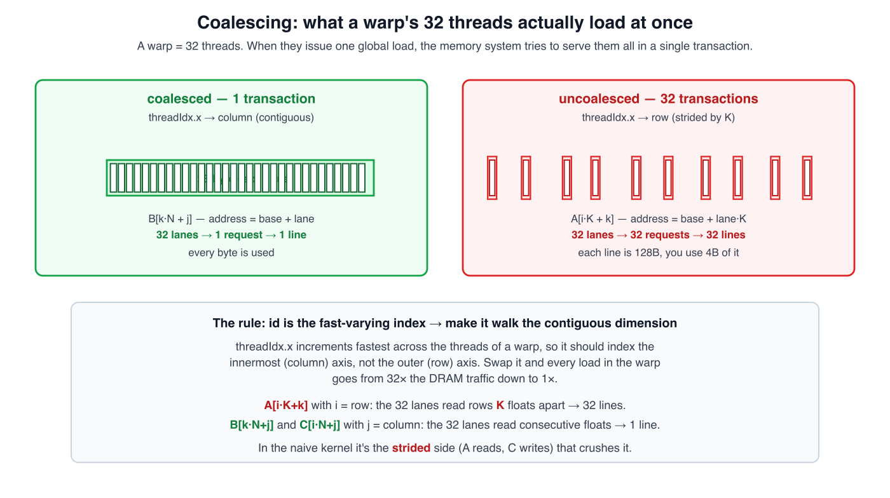
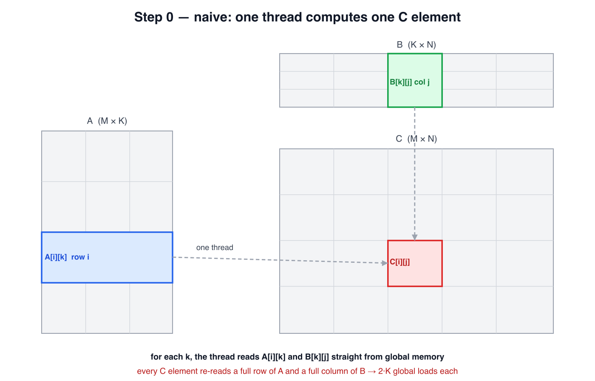
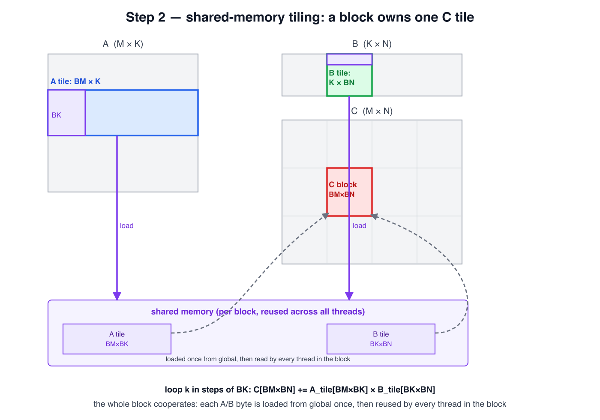
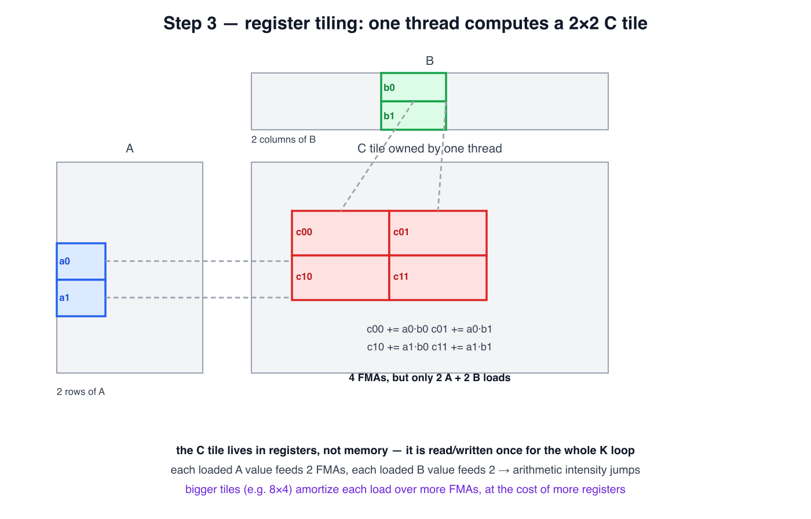
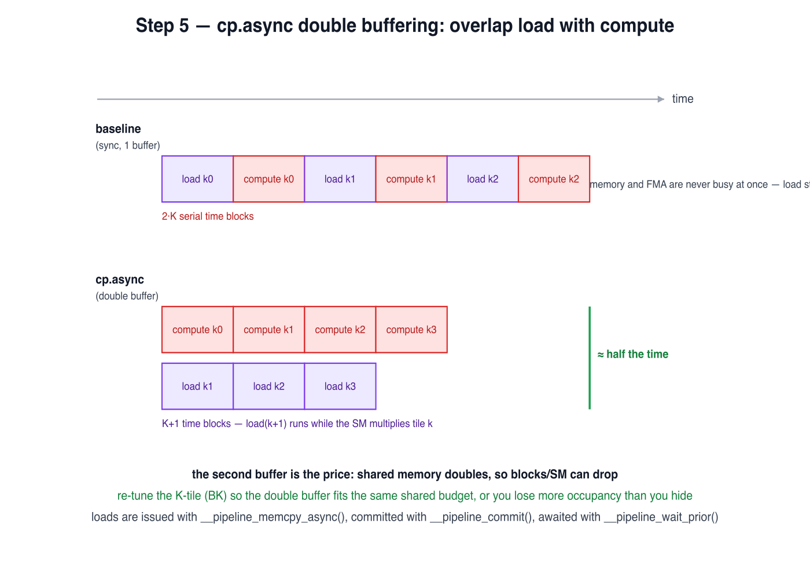
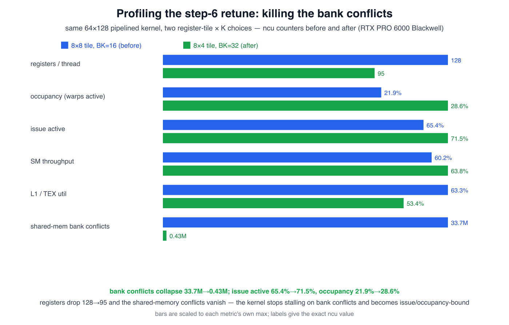

*Every kernel in this post computes the exact same 2·M·N·K floating-point
operations on the same matrices, validated against the same reference. The
fastest one runs **78× faster** than the slowest and lands at **83% of
cuBLAS** on a card where cuBLAS itself is only at 66% of peak. This is the
GPU half of the CPU matmul story: the bottleneck moves from DRAM to the
shared-memory-to-register boundary, and the fix at every step is the same
idea - move each byte up the hierarchy once, then reuse it many times.*

---

The CPU ladder climbed from 0.3 to 93 GFLOP/s by walking a five-level memory
hierarchy. A GPU has a smaller, steeper one: **global** memory (hundreds of
cycles, gigabytes per second), **shared** memory (a tiny per-block scratchpad,
~30 cycles), and **registers** (free, but only 255 per thread). The
arithmetic-intensify story is the same, but the *shape* of the problem
changes - on a GPU, blocks of hundreds of threads cooperate on a tile, so the
reuse happens at two levels: shared memory *within a step*, and registers
*within a thread*.

We'll climb the ladder on an **RTX Pro 6000 Blackwell (SM 12.0)**, nvcc
`-arch=sm_120`, FP32 throughout, 100 timed iterations, max-abs error against a
double-precision reference. The reference - cuBLAS's `sgemm` in its default
math mode - is genuine FP32, not TF32: I verified it produces bit-identical
results to `CUBLAS_PEDANTIC_MATH`, so this is an apples-to-apples FP32
comparison. (TF32 tensor cores are opt-in and I'll come back to them.)

Two numbers frame the whole thing. The FP32 FFMA peak of this card is
**188 SMs × 128 cores × 2 × 2.43 GHz = 117 TFLOP/s**. cuBLAS at 78
TFLOP/s is **66% of that peak**. So "we're at 83% of cuBLAS" *understates*
the headroom - both my kernel and cuBLAS are far from the wall, and the last
drop to cuBLAS is a different kernel structure, not a tuning knob.

## First, how a warp actually reads memory

A GPU never runs one thread at a time. It runs **warps** - a warp is 32
threads that execute the same instruction in lockstep: the warp scheduler
issues one instruction per cycle to all 32 lanes at once, each on its own
data. When that instruction is a global load, the memory system tries to
satisfy *all 32* threads in one shot. It can, if the 32 addresses fall inside
the same 128-byte aligned line - i.e. if they're **contiguous**. That's
**coalescing**.

(Strictly, this lockstep is the SIMT *programming model* for uniform control
flow, not a hardware guarantee. If threads in a warp diverge, the warp runs
each path in turn with the idle lanes masked off; and since Volta,
independent thread scheduling gives each thread its own program counter and
lets threads diverge and reconverge at sub-warp granularity. So treat
lockstep as a model rather than a guarantee - it doesn't change the
coalescing point, which is about the 32 addresses a warp issues in one
instruction.)

If the 32 threads in a warp instead hit 32 *different* lines (strided
addresses), the load splits into up to 32 separate transactions, each fetching
a full line, and you use 4 bytes of each 128 you pulled in. That's a 32×
waste of DRAM bandwidth. So the cardinal rule is:

> **`threadIdx.x` is the fast-varying index across a warp - make it walk the
> contiguous (column) dimension of your data.** Swap it and every load in the
> warp goes from 32 transactions down to 1.



With that lens, here's the naive kernel - and it turns out one thread per
output is *already* terrible in a second, independent way.

## The profiler first: what each step is actually limited by

I profiled every kernel in this ladder with Nsight Compute (`ncu`, `-arch=sm_120`)
and kept one rule: **profile first, then guess.** Each step below was chosen
because the profiler said the *previous* kernel was limited by exactly the
thing that step adds - so the numbers at each step aren't decoration, they're
the reason for the next step.

Read them as a **migration** - the thing that's busy, and the stall that
dominates, move as the kernel gets better:

- **Steps 0-1: memory-latency bound.** Warps wait on global loads
  (`long_scoreboard`). Step 0's access bug makes that stall 16 cycles per
  warp vs 4 after coalescing - the whole SM issues new work only 3.7% of
  cycles.
- **Steps 2-3: shared-memory / MIO bound.** Block-level reuse works, but
  shared loads are issued faster than the FMA units consume them (MIO
  throttle), and it's still stream-bound at the L1 pipe.
- **Steps 4-6: occupancy / issue bound.** Latency is hidden, so the limit is
  how many warps are resident to fill issue slots. The register file and the
  shared-memory footprint are what cap occupancy now.

## Step 0 - naive: one thread, one C element

```c
__global__ void naive(const float* A, const float* B, float* C, int M, int N, int K) {
    int i = blockIdx.y * blockDim.y + threadIdx.x;   // threadIdx.x walks the ROW
    int j = blockIdx.x * blockDim.x + threadIdx.y;   // threadIdx.y walks the COLUMN
    float acc = 0.f;
    for (int k = 0; k < K; k++)
        acc += A[i*K + k] * B[k*N + j];
    C[i*N + j] = acc;
}
```



**0.83 TFLOP/s at 2048³ and 4096³ (≈1% of cuBLAS).** Each output is a thread,
and that thread re-reads a **full row of A and a full column of B from global
memory for every output**. There is no reuse at all - total global traffic is
2·M·N·K reads, each 4 bytes. That alone makes it memory-bound. But look at the
mapping: `threadIdx.x` - the index that increments fastest across a warp -
indexes the **row** `i`. So the 32 threads in a warp read `A[i*K + k]` at
addresses `K` floats apart and write `C[i*N + j]` at `N` floats apart, i.e.
32 separate cache lines per access. Every load and store from a warp is a
**split transaction**. This is the worst of both worlds: no reuse *and*
uncoalesced.

**Profile (ncu, 2048³):**

| Metric                 | Value                                  |
| ---------------------- | -------------------------------------- |
| Throughput             | **0.83 TFLOP/s** (0.83 @ 4096³) |
| Issue rate             | 3.7%                                   |
| Occupancy              | 66%                                    |
| Registers / thread     | 37                                     |
| Shared mem / block     | 0 KB                                   |
| Busiest unit           | L1 98%                                 |
| L2 hit rate            | 98%                                    |
| DRAM utilization       | 0.08%                                  |
| Dominant stall / limit | memory latency (16.1 cycles)           |

The whole A and B (32 MB at 2048³) fit in this card's 134 MB L2, so the
kernel never reaches DRAM - it's just flooding the L1 pipe with ~32× too many
requests. **What step 1 fixes:** turn those 32 split transactions per access
into 1.

## Step 1 - global memory coalescing: make a warp read contiguous memory

The fix is a one-line swap. Let `threadIdx.x` index the column, not the row:

```c
__global__ void naive(const float* A, const float* B, float* C, int M, int N, int K) {
    int i = blockIdx.y * blockDim.y + threadIdx.y;   // threadIdx.y -> ROW (slow axis)
    int j = blockIdx.x * blockDim.x + threadIdx.x;   // threadIdx.x -> COLUMN
    float acc = 0.f;
    for (int k = 0; k < K; k++)
        acc += A[i*K + k] * B[k*N + j];
    C[i*N + j] = acc;
}
```

Now the 32 threads in a warp read `B[k*N + j]` and write `C[i*N + j]` at
consecutive addresses (they differ only by `j`), so each is **one** 128-byte
transaction. `A[i*K + k]` becomes a **broadcast** - all 32 lanes share the same
`i`, so they read the same address. Nothing else changed.

### Why that swap is worth 7.4×

This is about memory *transactions*, not math. A warp's 32 addresses are
coalesced into as few 128-byte transactions as possible; if they land on 32
different lines it's 32 transactions, each pulling a full 128 bytes to use 4.

Within a 32×32 block, a warp has a fixed `threadIdx.y` and a `threadIdx.x`
that runs `0…31` (linear id `ty*32 + tx`). So across a warp, **`threadIdx.x`
is the varying index and `threadIdx.y` is constant** - whatever you map
`threadIdx.x` to is the only thing that differs between lanes. That one choice
fixes the entire access pattern:

- **Uncoalesced** (`threadIdx.x → row`): `i` varies across lanes, `j` is fixed.
  - `C[i*N + j]` → lanes differ by a stride of `N` floats → **32 transactions**.
  - `A[i*K + k]` → stride of `K` floats → **32 transactions**.
  - `B[k*N + j]` → same address for all lanes → **1** (broadcast).
  - ≈ 64 transactions to write one output element.
- **Coalesced** (`threadIdx.x → col`): `j` varies, `i` is fixed.
  - `C[i*N + j]` → consecutive addresses → **1 transaction**.
  - `B[k*N + j]` → consecutive → **1 transaction**.
  - `A[i*K + k]` → all lanes the same → **1** (broadcast).
  - ≈ 2 transactions.

The fix removes the split transactions, so the kernel stops issuing ~32× too
many requests on the two strided accesses. It's ~7.4× in practice rather than
32× because `B` was *already* a broadcast, and because this kernel is still
memory-bound (no reuse) - it's now limited by **bytes moved**, not by
transactions issued.

**6.15 TFLOP/s at 2048³, 6.59 at 4096³ (8.5% of cuBLAS).** That single line is
**7.4× faster** (0.83 → 6.15 at 2048³). But the kernel is *still*
memory-bound: there's still no reuse, so a warp still streams a full A row and
B column from global for every output tile. Coalescing just stopped it from
throwing away 32× of the requests it was already making. The next step attacks
the reuse itself.

**Profile (ncu, 2048³):**

| Metric                 | before (step 0)             | after (step 1)                        |
| ---------------------- | --------------------------- | ------------------------------------- |
| Throughput             | 0.83 TFLOP/s (0.83 @4096³) | **6.15 TFLOP/s** (6.59 @4096³) |
| Issue rate             | 3.7%                        | 27%                                   |
| Occupancy              | 66%                         | 67%                                   |
| Registers / thread     | 37                          | 37                                    |
| Shared mem / block     | 0 KB                        | 0 KB                                  |
| Busiest unit           | L1 98%                      | L1 88%                                |
| L2 hit rate            | 98%                         | 98%                                   |
| DRAM utilization       | 0.08%                       | 0.60%                                 |
| Dominant stall / limit | memory latency (16.1 cyc)   | memory latency (4.2 cyc)              |

The split transactions are gone - that's the 7.4× - but the kernel still has
*zero* reuse, so a warp waits on a fresh global load for every output.
**What step 2 fixes:** load a tile once into shared memory and let the whole
block reuse it, cutting global loads per output by an order of magnitude.

## Step 2 - shared-memory tiling: a block owns a C tile

The fix is to make a **block** of threads cooperate on one tile of C, so the
A and B tiles it needs are loaded into shared memory once and reused by every
thread in the block.



Here's the kernel (`src/03-cuda-matmul/gpu_matmul_ladder.cu`):

```cuda
__global__ void matmul_tiled(const float* __restrict__ A, const float* __restrict__ B,
                             float* __restrict__ C, int M, int N, int K) {
    constexpr int T = 32;
    __shared__ float As[T][T];   // one copy per block
    __shared__ float Bs[T][T];   // one copy per block
    int tx = threadIdx.x, ty = threadIdx.y;
    int row = blockIdx.y * T + ty;
    int col = blockIdx.x * T + tx;
    float acc = 0.0f;
    for (int kb = 0; kb < K; kb += T) {
        // each thread writes just ONE element of the shared tile...
        As[ty][tx] = (row < M && kb + tx < K) ? A[row * K + kb + tx] : 0.0f;
        Bs[ty][tx] = (kb + ty < K && col < N) ? B[(kb + ty) * N + col] : 0.0f;
        __syncthreads();                  // ...then the WHOLE tile is visible to the block
        #pragma unroll
        for (int k = 0; k < T; ++k) acc += As[ty][k] * Bs[k][tx];
        __syncthreads();                  // no one rewrites the tile until all reads are done
    }
    if (row < M && col < N) C[row * N + col] = acc;
}
```

The key idea is that **shared memory is shared by every thread in a block**

it's not per-thread. A thread writes only one element of `As`/`Bs`
(`As[ty][tx]`), but during the compute loop every thread reads the *whole*
tile: `As[ty][k]` walks a slice of every row the block loaded and `Bs[k][tx]`
a slice of every column. That block-wide reuse is the entire point - each A/B
element is read from global **once per block**, not once per output element.

Two things about where that memory lives. Shared memory is **on-chip SRAM in
the SM**, not VRAM - and it's genuinely *block-scoped*: one block gets one
scratchpad, and every thread in that block reads and writes the same `As`/`Bs`.
It isn't per-thread, and it isn't reachable from other blocks. That
block-scoped scratchpad is exactly what makes the reuse possible.

And it's far faster to reach than VRAM. A global (VRAM) load has to leave the
SM, go out to HBM, and come back - a few hundred cycles on this class of card,
and that off-chip bandwidth is shared by every SM on the GPU. A shared-memory
load is served by the SM's own SRAM in a few tens of cycles (the ~30 cycles
from the intro) and doesn't compete with the other SMs for HBM. So once the
block has its A/B tile in shared memory, the compute loop reads it from a pool
that's much closer and faster than the VRAM it came from - which is precisely
why loading once and reusing beats streaming from global over and over.

The two `__syncthreads()` calls are what make that safe. The first stops a
fast thread from reading a stale (or still-unwritten) slot before its
neighbours have loaded it. The second stops a fast thread from overwriting the
tile for the next `kb` while a slower thread is still reading this one. Drop
them and threads read garbage.

A 32×32 block of threads owns a 32×32 tile of C, loading a fresh 32×32 chunk
of A and B into shared memory each K-step.

**8.55 TFLOP/s at 4096³ (11%).** The jump is underwhelming, and that's the
GPU-specific lesson: shared memory is not free. A block's shared usage caps
how many blocks fit on an SM, and for this small 32×32 tile the load-to-
compute ratio is still poor - the block stalls on `__syncthreads()` because
the shared loads are tiny and frequent. The bottleneck has just moved from
DRAM to the shared-memory wall.

**Profile (ncu, 2048³):**

| Metric                 | before (step 1)             | after (step 2)                        |
| ---------------------- | --------------------------- | ------------------------------------- |
| Throughput             | 6.15 TFLOP/s (6.59 @4096³) | **8.53 TFLOP/s** (8.55 @4096³) |
| Issue rate             | 27%                         | 21%                                   |
| Occupancy              | 67%                         | 67%                                   |
| Registers / thread     | 37                          | 38                                    |
| Shared mem / block     | 0 KB                        | 8 KB                                  |
| Busiest unit           | L1 88%                      | L1 77%                                |
| L2 hit rate            | 98%                         | 98%                                   |
| DRAM utilization       | 0.60%                       | 0.77%                                 |
| Dominant stall / limit | memory latency (4.2 cyc)    | MIO throttle (21.1 cyc)               |

Two shared loads feed only one FMA, so the shared pipe saturates long before
the FMAs do. **What step 3 fixes:** put the reuse *inside a thread* with a
register tile, so each shared load feeds several FMAs instead of one -
arithmetic intensity per shared byte goes up and the MIO pressure drops.

## Step 3 - register tiling: a thread computes a small C tile

The block tile got us reuse *across threads*. Now get reuse *within a thread*:
have each thread compute a small tile of C in **registers**, so every value it
loads from shared feeds several FMAs.



With a 2×2 C tile per thread, each shared A value is reused 2× and each shared
B value 2×. The C tile lives entirely in registers - it's read and written
once for the whole K loop.

**25.68 TFLOP/s at 4096³ (33%).** Now we're getting somewhere: arithmetic
intensity doubled, and the kernel is moving from memory-bound to closer to
compute-bound. This is the same register-blocking moment as the CPU post -
but on a GPU there's a sharper trade-off: the register tile sizes the C tile,
which sizes the minimum register count, which sets occupancy. There's no
free lunch.

**Profile (ncu, 2048³):**

| Metric                 | before (step 2)             | after (step 3)                          |
| ---------------------- | --------------------------- | --------------------------------------- |
| Throughput             | 8.53 TFLOP/s (8.55 @4096³) | **24.85 TFLOP/s** (25.68 @4096³) |
| Issue rate             | 21%                         | 41%                                     |
| Occupancy              | 67%                         | 90%                                     |
| Registers / thread     | 38                          | 40                                      |
| Shared mem / block     | 8 KB                        | 4 KB                                    |
| Busiest unit           | L1 77%                      | L1 86%                                  |
| L2 hit rate            | 98%                         | 98%                                     |
| DRAM utilization       | 0.77%                       | 2.33%                                   |
| Dominant stall / limit | MIO throttle (21.1 cyc)     | shared/MIO (9.7 cyc)                    |

Occupancy jumps to 90% and issue to 41%, but the 2×2 tile is still small, so
each shared load feeds only 4 FMAs. **What step 4 fixes:** a bigger block +
bigger register tile raises reuse again, at the cost of registers - which is
the trade-off the next step has to navigate.

## Step 4 - tuning: block, K-tile, and thread shape together

The point of this step is that the block shape and the register tile must be chosen together. A big block gives more reuse but fewer blocks per SM; a big register tile gives more per-thread reuse but burns registers and cuts occupancy. Sweeping these gives a coupling the tips don't prepare you for: the best config at this stage is a **64×128 block, BK=32, with 16×8 threads** (128 threads), each thread holding an **8×8 register tile (64 accumulators)**. That single config tops out at **50.72 TFLOP/s at 4096³ (65%)** without the pipelining from the next step.

The kernel reuses data well now, but it still stalls: two `__syncthreads()` per K-step serialize load and compute, so the FMA units sit idle while the block loads the next tile.

**Profile (ncu, 2048³):**

| Metric                 | before (step 3)               | after (step 4)                          |
| ---------------------- | ----------------------------- | --------------------------------------- |
| Throughput             | 24.85 TFLOP/s (25.68 @4096³) | **39.55 TFLOP/s** (50.72 @4096³) |
| Issue rate             | 41%                           | 42%                                     |
| Occupancy              | 90%                           | 22%                                     |
| Registers / thread     | 40                            | 128                                     |
| Shared mem / block     | 4 KB                          | 24 KB                                   |
| Busiest unit           | L1 86%                        | L1 44%                                  |
| L2 hit rate            | 98%                           | 94%                                     |
| DRAM utilization       | 2.33%                         | 3.26%                                   |
| Dominant stall / limit | shared/MIO (9.7 cyc)          | occupancy (22%)                         |

128 registers/thread caps the register file at ~4 blocks/SM, and the stall costs
are already small (hot spots ~2 cycles) - there just aren't enough resident
warps to fill the SM. The `__syncthreads` serialization is a second,
independent problem. **What step 5 & 6 fix:** `cp.async` overlaps the load and
compute phases so latency is hidden without needing more warps, and the
register-tile retune buys the occupancy back.

## Step 5 - scheduling: cp.async double-buffering

The baseline does each K-tile as *load → `__syncthreads` → compute →
`__syncthreads`*. The two barriers make the phases mutually exclusive: while
the block computes, the memory unit is idle; while it loads, the FMAs idle.



`cp.async` breaks that. It issues the global→shared copy asynchronously, so
the block can **prefetch tile k+1 while computing tile k**, into a second
buffer. Now the memory engine works during the FMA burst.

Here's the kernel. One template, instantiated differently for Step 5
(`<64,128,16,16,8,8,8>`: BK=16, 8×8 tile, 128 threads) and Step 6
(`<64,128,32,32,8,8,4>`: BK=32, 8×4 tile, 256 threads). The two
`__pipeline_*` calls and the double buffer are the whole trick: the global→
shared copy for tile *k+1* is issued *before* the FMAs compute tile *k*, into
the other buffer.

```cuda
// M, N, K are multiples of BM/BN/BK here, so the bounds checks are dropped.
template<int BM,int BN,int BK,int TX,int TY,int RY,int RX>
__global__ void matmul_pipe_dbl(const float* __restrict__ A, const float* __restrict__ B,
                                float* __restrict__ C, int M, int N, int K) {
    extern __shared__ float smem[];
    float (*As)[BM][BK] = reinterpret_cast<float(*)[BM][BK]>(smem);            // [stage][BM][BK]
    float (*Bs)[BK][BN] = reinterpret_cast<float(*)[BK][BN]>(smem + 2u*BM*BK); // [stage][BK][BN]
    const int nthread = TX*TY;
    int tid = threadIdx.y*TX + threadIdx.x;
    float acc[RY][RX] = {};

    auto load_stage = [&](int st, int kb) {          // 16-byte cp.async copy of tile kb -> stage st
        for (int v=tid; v<BM*BK/4; v+=nthread)
            __pipeline_memcpy_async(&As[st][v/(BK/4)][(v%(BK/4))*4],
                                    &A[(blockIdx.y*BM + v/(BK/4))*K + kb + (v%(BK/4))*4], 16);
        for (int v=tid; v<BK*BN/4; v+=nthread)
            __pipeline_memcpy_async(&Bs[st][v/(BN/4)][(v%(BN/4))*4],
                                    &B[(kb + v/(BN/4))*N + blockIdx.x*BN + (v%(BN/4))*4], 16);
    };

    load_stage(0, 0); __pipeline_commit(); __pipeline_wait_prior(0); __syncthreads();
    for (int kb=0; kb<K; kb+=BK) {
        int st = (kb/BK) & 1;                                                  // current buffer
        if (kb+BK < K) { load_stage(st^1, kb+BK); __pipeline_commit(); }       // prefetch the next tile
        #pragma unroll
        for (int k=0;k<BK;++k){
            float a[RY], b[RX];
            for (int i=0;i<RY;++i) a[i] = As[st][threadIdx.y*RY+i][k];
            for (int j=0;j<RX;++j) b[j] = Bs[st][k][threadIdx.x*RX+j];
            for (int i=0;i<RY;++i)
                for (int j=0;j<RX;++j) acc[i][j] += a[i]*b[j];
        }
        __pipeline_wait_prior(0); __syncthreads();                             // prefetched tile is ready
    }
    #pragma unroll
    for (int i=0;i<RY;++i)
        for (int j=0;j<RX;++j) C[(blockIdx.y*BM+threadIdx.y*RY+i)*N + (blockIdx.x*BN+threadIdx.x*RX+j)] = acc[i][j];
}
```

*Full kernel (with the bounds checks, the `SWAP` variant, and the launch
wrapper): [`src/03-cuda-matmul/gpu_matmul_pipeline.cu`](https://github.com/nguyenhoangthuan99/optimization-diaries/tree/main/src/03-cuda-matmul/gpu_matmul_pipeline.cu).
The block above is trimmed — it drops the bounds checks and the `SWAP` branch,
which weren't the winner.*

| Configuration                 | Shared | Blocks/SM |     Warps/SM |          2048³ |          4096³ |
| ----------------------------- | -----: | --------: | -----------: | --------------: | --------------: |
| tuned, no pipeline (BK=32)    |  24 KB |         4 |           16 |           39.55 |           50.72 |
| double buffer, BK=32          |  48 KB |         2 |  **8** |           41.98 |           53.25 |
| double buffer,**BK=16** |  24 KB |         4 | **16** | **50.05** | **63.40** |

The first try (double-buffer at BK=32) barely moved: **pipelining is not
free.** The second buffer doubled the shared footprint (24→48 KB), so blocks/SM
dropped from 4 to 2 and occupancy halved to 8 warps. We hid the load latency
but gave away the occupancy that hides it too.

The fix re-tunes K for the pipeline: **BK=16** halves the tile so the double
buffer fits in **24 KB - the same shared budget as the non-pipelined BK=32
kernel**. Occupancy holds at 4 blocks / 16 warps, but now the loads are
asynchronous. That combination is the win: **50.05 at 2048³ and 63.40 at
4096³ (81%)**.

Two notes: BK=8 was *worse* (45.9 at 2048³) - below BK=16 the loop and
`cp.async`-issue overhead outweighs the overlap. And a triple buffer didn't
help (50.45 at 4096³) because at 4 blocks/SM the latency is already hidden.
Same lesson as the CPU ladder: **a scheduling optimization is also a resource
trade-off.**

**Profile (ncu, 2048³):**

| Metric                 | before (step 4)               | after (step 5)                          |
| ---------------------- | ----------------------------- | --------------------------------------- |
| Throughput             | 39.55 TFLOP/s (50.72 @4096³) | **50.05 TFLOP/s** (63.40 @4096³) |
| Issue rate             | 42%                           | 65%                                     |
| Occupancy              | 22%                           | 22%                                     |
| Registers / thread     | 128                           | 128                                     |
| Shared mem / block     | 24 KB                         | 24 KB                                   |
| Busiest unit           | L1 44%                        | L1 63%                                  |
| L2 hit rate            | 94%                           | 94%                                     |
| DRAM utilization       | 3.26%                         | 5.07%                                   |
| Dominant stall / limit | occupancy (22%)               | occupancy (22%)                         |

The `long_scoreboard` memory-latency stall that dominated the first three steps
has nearly vanished (0.02 cycles) - the loads are hidden - and issue jumps to
65%. What caps it now is the `cp.async` shared footprint (24 KB) plus ~128
registers/thread, which limits resident warps. **What step 6 fixes:** change the
register tile so more warps fit per SM.

## Step 6 - the register retune that made it compute-bound

Double-buffered, the kernel is still stall-bound. The profiler shows why:

- **128 registers/thread** - exactly at the 128-register boundary, so the
  register file still only holds 4 blocks/SM (16 warps).
- **33.7 million shared-memory bank conflicts** on the loads, with L1/TEX at
  63.3% - the most-used unit. The warps are serializing on the shared-memory
  pipe, not the FMA units.

Two "obvious" fixes made it worse, which is worth knowing:

- **Swizzling/padding the shared layout** to kill the bank conflicts: it forced
  the 16-byte async global→shared copies to become scalar, and the lost
  vectorization cost more than the conflicts saved.
- **`__launch_bounds__` to force more blocks/SM**: pushing under 128 registers
  spilled to local memory, and the spill outweighed the occupancy gain.

The lever that worked was the **per-thread register tile.** Swapping the
8×8 tile (64 accumulators, 128 threads) for an **8×4 tile** (32 accumulators,
256 threads) cut registers to **95** and doubled the warps per block (4 → 8).
Re-tuning K to **BK=32** at the same time halved the pipeline-stage count and
raised reuse.

| Configuration                    |    Registers |       Occupancy |           Issue |         2048³ |         4096³ |
| -------------------------------- | -----------: | --------------: | --------------: | -------------: | -------------: |
| pipelined, 8×8, BK=16           |          128 |           21.9% |           65.4% |           48.0 |           57.5 |
| **pipelined, 8×4, BK=32** | **95** | **28.6%** | **71.5%** | **54.3** | **65.0** |
| cuBLAS (FP32)                    |           — |              — |              — |          63.78 |          77.96 |

The "before" row is the same 8×8 / BK=16 config as Step 5; it reads ~4% lower here (48.0 vs 50.05 at 2048³) because `ncu` adds profiling overhead.

The profile flipped (all counters from `ncu` on the same harness):



- Shared-memory bank conflicts: **33.7M → 0.43M**.
- Issue active: **65.4% → 71.5%**. SM throughput: **60.2% → 63.8%**.
- Achieved occupancy: **21.9% → 28.6%**. L1/TEX: 63.3% → 53.4%. L2 hit: **94%**.

The kernel is now **compute-bound and well-balanced**. Occupancy caps at 33%
by *both* registers and shared memory (16 warps/SM either way) - but the 8×4
config actually reaches more of that cap (28.6% vs 21.9%) because the bank
conflicts no longer serialize warps on the LSU. The dominant stall is now
`not_selected` - there's enough parallelism to hide latency, so adding more
wouldn't help. That's a genuinely different regime from where we started.

**Profile (ncu, 2048³):**

| Metric                 | before (step 5)               | after (step 6)                        |
| ---------------------- | ----------------------------- | ------------------------------------- |
| Throughput             | 50.05 TFLOP/s (63.40 @4096³) | **54.3 TFLOP/s** (65.0 @4096³) |
| Issue rate             | 65%                           | 71.5%                                 |
| Occupancy              | 22%                           | 28.6%                                 |
| Registers / thread     | 128                           | 95                                    |
| Shared mem / block     | 24 KB                         | 48 KB                                 |
| Busiest unit           | L1 63%                        | L1 53%                                |
| L2 hit rate            | 94%                           | 94%                                   |
| DRAM utilization       | 5.07%                         | 5.21%                                 |
| Dominant stall / limit | occupancy (22%)               | `not_selected` / issue (71%)        |

The 8×4 tile runs a 32×8 block, so 2 blocks hold 256 threads each (up from
4×128 before). The bank conflicts are gone, so warps reach the FMA units and
issue jumps to 71.5% - the register file, not the loads, is now the binding
constraint on occupancy.

## Cross-check: the canonical siboehm kernel converges to the same ceiling

To sanity-check that ~83% is really the ceiling, I ran the canonical CUDA
matmul warp-tiling kernel from Simon Boehm's excellent
[*How to Optimize a CUDA Matmul Kernel for cuBLAS-like Performance: a
Worklog*](https://siboehm.com/articles/22/CUDA-MMM) — the [SGEMM_CUDA
repository](https://github.com/siboehm/SGEMM_CUDA) (MIT licensed). I took the
kernel unchanged, just built it `-arch=sm_120`. Boehm's write-up is the
reference walkthrough I'd point anyone to for this exact ladder — it's where I
first absorbed the coalescing → shared-memory tiling → register tiling →
warp-tiling story this post re-treads — so if this post is useful, his is the
original. His kernel reaches 93.7% of cuBLAS on an A6000, a strong reference
point for what a well-tuned hand-written FP32 kernel looks like.

| Kernel                                              |         2048³ |         4096³ | % of cuBLAS (4096³) |
| --------------------------------------------------- | -------------: | -------------: | -------------------: |
| cuBLAS FP32                                         |          63.78 |          77.96 |                 100% |
| siboehm warp tiling (BM=BN=128, BK=16, TM=8 / TN=4) |           41.3 |           65.4 |                  84% |
| this post (pipelined, 8×4, BK=32)                  | **54.3** | **65.0** |        **83%** |

The striking part: **siboehm's kernel is fully synchronous - no `cp.async`, no
double buffering - yet it lands at 84% of cuBLAS, right next to my pipelined
kernel.** Two independent from-scratch FP32 kernels, one hiding latency with
async copies, the other with ~128 accumulators per thread, settle within 1% of
each other at 4096³.

To measure how much `cp.async` actually contributes, I ran a controlled A/B -
identical block tile, K-tile, register tile, and shared layout; the *only*
change is single-buffer sync vs `cp.async` double-buffer:

| (same 64×128, BK=32, 8×4, 256 threads) |         2048³ |         4096³ |
| ---------------------------------------- | -------------: | -------------: |
| synchronous single-buffer                |           41.2 |           52.8 |
| `cp.async` double-buffer               | **53.4** | **65.8** |

`cp.async` gives a real **+30% / +25%** - it's not a red herring. But it's not
the whole story either. siboehm reaches the same ~65 TFLOP/s *without* it by
giving each thread ~128 accumulators, which raises arithmetic intensity enough
that the FMA chain itself hides the load latency. Two different ways to hide
memory latency, same ceiling.

Two honest notes from that cross-check:

- **siboehm's kernel doesn't generalize to smaller matrices.** At 2048³ it's
  41.3 TFLOP/s vs my 54.3 - the fixed 128×128 block tile leaves more grid
  quantization when the matrix is smaller. (The "tune block and register tile
  together" lesson.)
- **The double-buffered variants in that repo don't help on SM 120.** The
  synchronous double-buffer version fails correctness verification here, and
  the `cuda::barrier` `cp.async` version is ~8× slower (10.6 TFLOP/s at
  4096³). `cp.async` only pays off in the per-stage
  `__pipeline_memcpy_async`/`__pipeline_commit` form I used, not the
  `cuda::barrier` form.

### Can you get both - high arithmetic intensity *and* cp.async?

I tried the obvious next step: take siboehm's warp-tiling structure (128
accumulators/thread) and bolt a per-stage `cp.async` double buffer onto it.
It's a clear **loss**:

| (128 threads, 128 accumulators, BM=BN=128, BK=16) | 2048³ |         4096³ |
| ------------------------------------------------- | -----: | -------------: |
| siboehm - transposed A, no async                  |   41.3 |           65.4 |
| +`cp.async` double-buffer, but row-major A      |   25.2 | **38.0** |

It's correct (max_abs 4e-4) but drops from 65.4 to 38.0. The reason is
structural, not a bad config choice:

- `cp.async` copies a **contiguous 16-byte** chunk global→shared, so A has to
  be stored **row-major** `[m][k]`.
- But siboehm's speed comes precisely from the **transposed** `[k][m]` layout,
  which makes the shared→register compute loads contiguous, vectorized
  (`LDS.128`), and conflict-free.
- Storing A row-major to enable `cp.async` turns those reads scalar and
  strided. The kernel is still `162 registers/thread, 0 spills`, but the
  strided shared reads become the bottleneck.

So you can't bolt `cp.async` onto siboehm's structure without giving up the
layout that makes it fast. **You have to choose: async global loads *or*
conflict-free vectorized register loads.**

## What's left: why cuBLAS is still ~15-17% ahead

The peak number reframes the ending. On this card, cuBLAS at 78 TFLOP/s is
**66% of the 117 peak**, and my kernel at 65 is **56%**. So the remaining gap
is not "one magic instruction" - and I now think "just use `ldmatrix`" is the
wrong framing for it:

- For **32-bit** data, `ldmatrix` has **no transpose variant**. The `.trans`
  form is 16-bit only; for TF32/FP32, CUTLASS does the transpose with an
  ordinary shared→register load instead.
- The `mma` path `ldmatrix` feeds is the tensor-core route, which for pure
  FP32 you can't use without dropping to TF32 precision - and TF32 is a
  different numerical contract (I measured it at **147 TFLOP/s at 2048³ but
  with a 2e-2 max-abs error**; genuine FP32 cuBLAS is bit-identical to
  pedantic math, error 0).

I burned a session trying every remaining "classic" lever, and they all
plateau:

- **Bank conflicts are already gone.** A is broadcast within a warp (all 32
  lanes share `threadIdx.y`, so the same address), B is a conflict-free
  `float4` across the 32 column groups. A deliberate swizzle gained ~1% and
  cost 29 registers.
- **A deeper `cp.async` pipeline (3-4 stages) hurt**: 65.0 → 59.4 (3-stage) /
  56.9 (4-stage), because occupancy halved to 8 warps/SM.
- **A bigger 128×128 block** (8×8 register tile, 64 accumulators) tied 65.4 at
  4096³ but collapsed to 43.1 at 2048³ from grid quantization.
- **Vectorizing A along K is structurally blocked.** A is `[m][k]` (K-
  contiguous) but B is `[k][n]` (N-contiguous) - the axes are orthogonal. You
  can't process a "K-quad" with both vectorized; doing so (as I first tried)
  is mathematically wrong. Doing it right requires B transposed to `[n][k]` in
  shared, which reintroduces the store-side bank conflicts siboehm already
  has. Net zero.

So the last ~15-17% to cuBLAS is a **different kernel structure** - cuBLAS's
register-level scheduling, possibly a K-split, and a shared-staged vectorized
C epilogue - not any single parameter I can pull from here. That's the honest
place to stop.

## The ladder, end to end

| Stage                                 |         2048³ |         4096³ | % of cuBLAS (4096³) |
| ------------------------------------- | -------------: | -------------: | -------------------: |
| naive, uncoalesced                    |           0.83 |           0.83 |                 ≈1% |
| + global-memory coalescing            |           6.15 |           6.59 |                 8.5% |
| shared-memory tiling                  |           8.53 |           8.55 |                  11% |
| 2×2 register tile                    |          24.85 |          25.68 |                  33% |
| 64×128, BK=32, 16×8 (tuned)         |          39.55 |          50.72 |                  65% |
| + cp.async double buffer (8×8 tile)  |          50.05 |          63.40 |                  81% |
| **+ 8×4 register tile, BK=32** | **54.3** | **65.0** |      **≈83%** |
| cuBLAS (FP32)                         |          63.78 |          77.96 |                  100 |

## Takeaways

- **The flops never changed.** From 0.83 to 65.0 TFLOP/s on the same matrices
  - a ×78 spread - purely by changing where bytes live. On a GPU, matmul is a
    memory problem before it's an arithmetic one, just like on a CPU.
- **Shared memory and registers are resources, not just steps.** A bigger
  pipeline buffer, a bigger register tile, a bigger block - each buys reuse
  and each spends occupancy. The tuning choice is always a *resource trade-off*,
  not a free win.
- **The profiler found the real bottleneck.** Bank conflicts were 33.7M before
  the register retune and 0.43M after; achieved occupancy went 21.9% → 28.6%
  and issue active 65.4% → 71.5%. Timings alone said "faster"; the counters
  said *why*: it stopped being shared-memory-bound.
- **Two independent kernels converge on the same ceiling.** Mine (cp.async)
  and Simon Boehm's (high arithmetic intensity) both land at ~83-84% of cuBLAS at
  4096³. That convergence is the signal: this is a real structure limit for
  hand-written FP32, not a tuning gap either of us is missing.
- **cuBLAS isn't magic here.** It's at 66% of peak. The remaining gap is a
  different kernel structure (register scheduling, possible split-K, staged
  epilogue), not a single instruction - and the tensor-core path that might
  close it isn't free, it changes the numerical contract.

This ladder - reuse in shared memory, reuse in registers, then schedule the
loads to hide latency - is exactly the anatomy of every fast GEMM, and the
same three ideas that make a fast flash-attention kernel, a fast convolution,
or a fast quantized matmul.

---

*Reproduce:
[github.com/nguyenhoangthuan99/optimization-diaries](https://github.com/nguyenhoangthuan99/optimization-diaries) -
per-step kernels in
[`src/03-cuda-matmul/`](https://github.com/nguyenhoangthuan99/optimization-diaries/tree/main/src/03-cuda-matmul):
`gpu_matmul_ladder.cu`, `gpu_matmul_sweep.cu`, `gpu_matmul_push.cu`,
`gpu_matmul_pipeline.cu`, `gpu_matmul_final.cu`. Build with
`nvcc -arch=sm_120` and run each to print its validated TFLOP/s. Measured on
one RTX Pro 6000 Blackwell (SM 12.0), CUDA 12.9, FP32, 100 iterations, median-
of-N; profiler counters from `ncu`. Figure sources are the `.svg` files
alongside each `.png` in
[`figures/03-cuda-matmul/`](https://github.com/nguyenhoangthuan99/optimization-diaries/tree/main/figures/03-cuda-matmul).*

---

*Reference & credit. The warp-tiling kernel in the cross-check, and much of the
memory-hierarchy framing (coalescing → shared-memory tiling → register tiling →
warp tiling), come from Simon Boehm's
[&#34;How to Optimize a CUDA Matmul Kernel for cuBLAS-like Performance: a
Worklog&#34;](https://siboehm.com/articles/22/CUDA-MMM) (Dec 2022) and his
[SGEMM_CUDA](https://github.com/siboehm/SGEMM_CUDA) repository (MIT). It's the
best single explanation I've read of how a CUDA GEMM gets fast, and this post
builds on it.*
