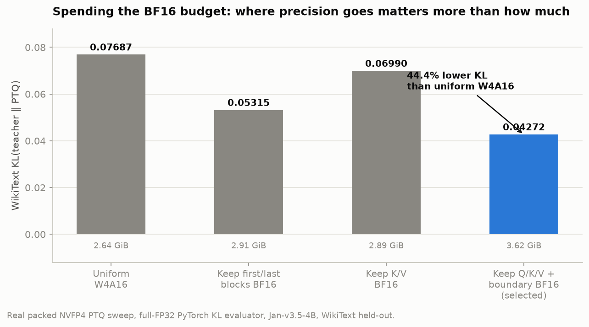
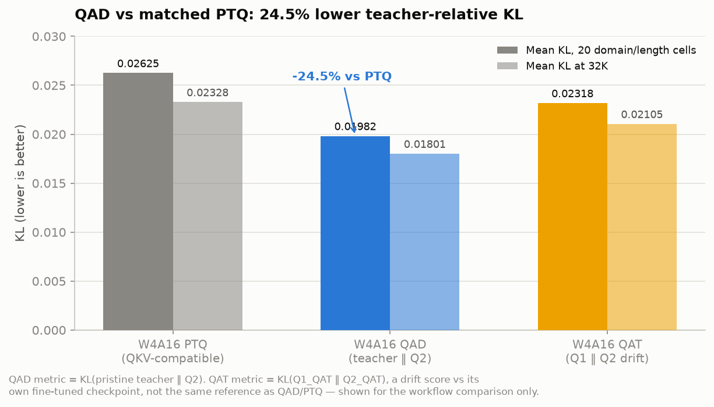
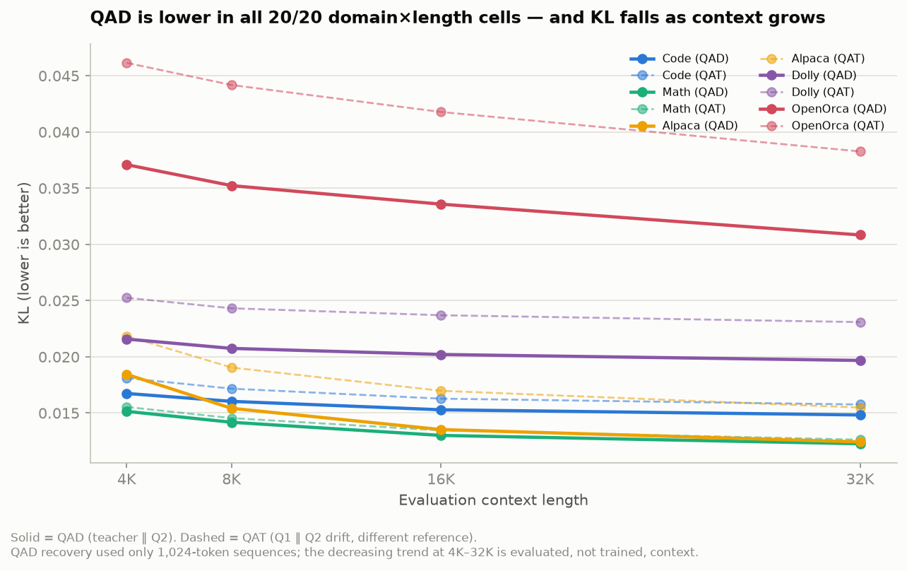
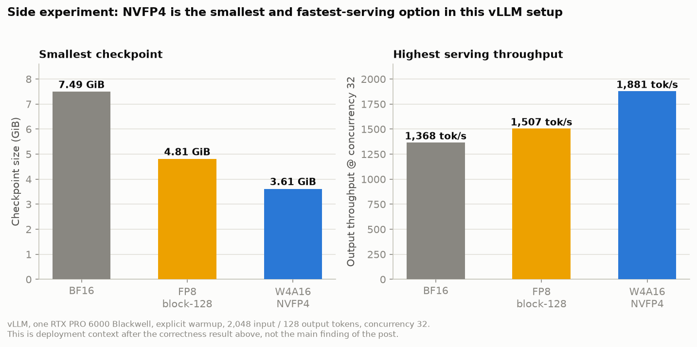

# [Four Bits Where It Counts] #4 — Before Serving Fast: QAT vs QAD for BF16-Faithful NVFP4

*Before optimizing serving throughput, I wanted to answer a more basic question: does the quantized model still behave like the BF16 model? I used Jan-v3.5-4B to choose a vLLM-compatible NVFP4 precision map, measure quantization error, and compare two recovery workflows: QAT during fine-tuning versus QAD after a full-BF16 model already exists.*

The main result is about **correctness**, not speed:

- Spending BF16 on the right projections and boundary blocks matters more than applying a uniform W4A16 recipe.
- QAD reduces the final W4A16 model's KL-to-teacher by **24.5%** relative to the matched PTQ checkpoint.
- For the goal of preserving the BF16 model's output distribution, QAD is the better-matched workflow because it directly optimizes teacher-to-student KL.
- The resulting vLLM-compatible QAD model reaches **0.0198 mean KL** across five domains and four context lengths.

Only after establishing that quality baseline did I run a secondary size-and-serving comparison against FP8 and BF16. That comparison is useful deployment context, but it is not the reason for the experiment.

## What the experiment found

These are the findings that matter before looking at the serving numbers:

1. **Correctness comes before speed.** The first decision was not which checkpoint serves the most tokens per second. It was which quantization map preserves the BF16 model's behavior well enough to deploy.

2. **The precision map matters.** Uniform W4A16 produced **0.07687 WikiText KL**. Keeping the first and last blocks in BF16 plus the attention projections reduced this to **0.04272**, a **44.4% reduction**, before any recovery training.

3. **Runtime constraints shape the map.** vLLM's fused-QKV implementation requires Q, K, and V to use the same precision. The final deployable map therefore keeps **all Q/K/V projections in BF16**, along with the first and last transformer blocks, while the remaining eligible weights use NVFP4.

4. **QAD improved the final quantized model.** With the same W4A16 map, QAD reduced mean teacher-relative KL from **0.02625 to 0.01982** across five domains and four context lengths: a **24.5% reduction**. At 32K, KL fell from **0.02328 to 0.01801**.

5. **QAT and QAD answer different workflow questions.** QAT exposes quantization during fine-tuning and uses next-token cross-entropy. QAD starts from a completed BF16 model, keeps the teacher frozen, and trains the quantized student against the teacher's output distribution. For the goal measured here—preserving the original BF16 distribution—QAD is the better-matched objective.

6. **QAD beat the reported QAT value in every held-out cell.** QAD was lower in all **20 of 20** domain/length cells, including code, math, Alpaca, Dolly, and OpenOrca at 4K, 8K, 16K, and 32K. The gap was largest on instruction-style data such as OpenOrca.

7. **The improvement generalized beyond the training sequence length.** QAD was trained with only **1,024-token sequences**, yet KL decreased steadily as evaluation length increased from 4K to 32K. This shows lower average next-token KL to the BF16 teacher at longer evaluated windows, despite 1K recovery training. It does not establish improved long-context task accuracy or rule out data/packing effects.

8. **The QAT/QAD comparison has an important metric caveat.** QAD is evaluated as `KL(pristine teacher ‖ Q2_QAD)`, while QAT is evaluated as `KL(Q1_QAT ‖ Q2_QAT)`, measuring drift from its own fine-tuned BF16 checkpoint. Therefore, the 20-cell result is strong evidence in favor of QAD's reported distributional behavior, but it is not a perfectly apples-to-apples teacher-relative ranking. A strict QAT-versus-QAD comparison would evaluate both quantized models against the same pristine teacher.

9. **Size and speed were secondary deployment results.** In the matched vLLM side experiment at concurrency 32, NVFP4 was the smallest checkpoint (**3.614 GiB**) and had the highest output throughput (**1,881 tok/s**) versus FP8 (**4.806 GiB**, **1,507 tok/s**) and BF16 (**7.49 GiB**, **1,368 tok/s**). These are deployment trade-offs, not a substitute for fidelity and downstream task evaluation.

## The question

The workflow is simple:

> **Before making a model serve fast, make sure the quantized model is correct.**

I treated this as three separate questions:

1. **Which W4A16 precision map gives the best quality for a vLLM-compatible checkpoint?**
2. **If the target is the original BF16 behavior, is it better to use QAT during fine-tuning or train in BF16 first and apply QAD afterward?**
3. **As a side experiment, what size and serving trade-off does the final NVFP4 option have versus BF16 and FP8?**

The first two questions are the core of the post. They are evaluated with a full-FP32 PyTorch KL measurement on held-out text. The third question is deliberately secondary and is measured separately with warmed-up vLLM serving.

The deployment target is a vLLM-compatible W4A16 NVFP4 checkpoint with:

- packed NVFP4 weights;
- BF16 activations;
- BF16 Q/K/V projections so vLLM can keep fused QKV consistent;
- BF16 first and last transformer blocks;
- Marlin W4A16 kernels;
- continuous batching and shared KV-cache capacity.

## The model and the precision map

The model is [Jan-v3.5-4B](https://huggingface.co/janhq/Jan-v3.5-4B), a dense Qwen3-family 4B model with 36 transformer blocks.

The selected deployment recipe is **W4A16 NVFP4**:

```text
Most linear weights: NVFP4, block size 16
Activations:         BF16
Q/K/V projections:   BF16
First block:         BF16
Last block:          BF16
lm_head/embeddings:  BF16
```

## The model-size comparison is secondary

This section is a side experiment, not the selection criterion. First I chose the NVFP4 precision map and evaluated the recovery methods using teacher-relative KL. Only then did I compare the resulting option with FP8 and BF16 for deployment context.

The Jan-v3.5-4B model has about 4.41 billion parameters. The measured vLLM-compatible files are:

| Representation                   |           File size | Mean KL over 20 cells |     Mean KL at 32K |
| -------------------------------- | ------------------: | --------------------: | -----------------: |
| BF16 checkpoint                  |           ~8.22 GiB |                    — |                 — |
| **FP8 E4M3 block-128 PTQ** | **4.806 GiB** |    **0.002172** | **0.001974** |
| **W4A16 NVFP4 PTQ**        | **3.614 GiB** |    **0.026251** | **0.023283** |
| **W4A16 NVFP4 QAD**        | **3.614 GiB** |    **0.019815** | **0.018010** |

The FP8 row is a measured ModelOpt FP8 E4M3 weight-only checkpoint with block size 128 and the same BF16 Q/K/V plus boundary exclusions used for the vLLM-compatible map. Its WikiText sanity KL is **0.003203**.

The W4A16 export is smaller because its main weight payload is FP4 rather than FP8. It is not a pure 4-bit file: BF16 Q/K/V, boundary layers, embeddings, the output head, and scale tensors remain part of the checkpoint. That mixed-precision map is the price of vLLM compatibility and quality recovery.

The Q/K/V exception is not cosmetic. vLLM fuses Q/K/V into a QKV projection. If only K/V remain BF16 while Q is quantized, vLLM rejects the checkpoint because all fused shards must have the same precision.

The deployable map therefore keeps **all three Q/K/V projections in BF16**. That makes the checkpoint compatible with vLLM’s fused-QKV implementation while retaining NVFP4 compression for the rest of the eligible weights.

## First: spend the BF16 budget where it matters

Before training anything, I swept W4A16 PTQ configurations using real packed NVFP4 weights and the same full-FP32 PyTorch KL evaluator.

| Configuration                        | Mean KL on WikiText |         Export size |
| ------------------------------------ | ------------------: | ------------------: |
| Uniform W4A16                        |             0.07687 |           2.639 GiB |
| Keep first/last blocks BF16          |             0.05315 |           2.909 GiB |
| Keep K/V BF16                        |             0.06990 |           2.892 GiB |
| **Keep Q/K/V + boundary BF16** |   **0.04272** | **3.616 GiB** |

The final vLLM-compatible export is larger than the original K/V-only recipe because Q must also stay BF16 for fused-QKV compatibility. That extra precision buys a **44.4% reduction in WikiText KL** relative to uniform W4A16:

```text
0.07687 → 0.04272
```



This is the first lesson of the experiment:

> **The most useful precision map is often constrained by the runtime, not just by the weight-error ranking.**

## QAT and QAD: independent experiments

The training arms were deliberately independent.

```text
Pristine Jan-v3.5 BF16
        ├── QAT → W4A16 QKV-compatible checkpoint
        └── QAD → W4A16 QKV-compatible checkpoint
```

Neither arm started from the other arm’s checkpoint.

Training configuration:

```text
GPUs:          4 per arm
Global batch:  64
Per-GPU batch: 2
Gradient accumulation: 8
Steps:         530
Learning rate: 1e-5 → 5e-7, cosine decay
Calibration:   32 UltraChat samples
Sequence:      1024 tokens
```

The two objectives are different:

### QAT: quantization-aware fine-tuning

QAT uses next-token cross-entropy while the W4A16 quantizers are active. The idea is to let the model adapt during fine-tuning so the quantized forward pass is part of what training sees.

To test whether the final quantization preserves that fine-tuned model, I measure quantization drift:

```text
KL(Q1_QAT || Q2_QAT)
```

where `Q1_QAT` is the trained BF16 reference and `Q2_QAT` is a fresh W4A16 quantization of it.

### QAD: full-BF16 training, then post-training calibration

QAD keeps the original BF16 model frozen as a teacher and trains the quantized student against it with forward KL. In other words, the model is trained normally in BF16 first; QAD is the later recovery/calibration stage.

Its primary metric is:

```text
KL(pristine teacher || Q2_QAD)
```

This is the distributional metric we care about for the final deployed model.

The workflows answer different practical questions:

- **QAT:** can the model adapt to quantization while it is being fine-tuned?
- **QAD:** after full-BF16 training is complete, can a short quantized recovery stage preserve the existing model's behavior?

Because QAT and QAD use different reference distributions, their raw KL values should not be treated as a direct ranking. QAT measures drift from the trained QAT model; QAD measures distance from the original teacher. The teacher-relative QAD score is the decisive result for the post's correctness goal.

## Evaluation protocol

The evaluation uses full-FP32 PyTorch KL with the teacher and quantized model kept in the same PyTorch evaluation path.

For each next-token position:

```text
teacher logits  → full FP32 log-softmax
model logits    → full FP32 log-softmax

KL = Σ P_teacher × (log P_teacher - log P_model)
```

There is no uint16 teacher-logit compression and no `log P > -16` vocabulary cutoff.

The held-out sweep contains:

- WikiText sanity evaluation at 1K;
- code;
- math;
- Alpaca;
- Dolly;
- OpenOrca;
- 4K, 8K, 16K, and 32K packed token windows;
- 262,144 token budget per domain/length cell.

## Full-sweep quality results

### The quality result

PTQ and QAD use the same W4A16 deployment map. QAT is included to answer the workflow question, but its drift score is not a teacher-relative quality score. The clean comparison for final-model correctness is therefore PTQ versus QAD, with QAT reported separately as quantization stability.

| Arm | What the KL measures | WikiText KL | Mean KL over 20 domain/length cells | Mean KL at 32K |
|---|---|---:|---:|---:|
| W4A16 PTQ, QKV-compatible | pristine teacher ‖ Q2 | 0.04272 | **0.02625** | **0.02328** |
| **W4A16 QAD** | **pristine teacher ‖ Q2** | **0.03217** | **0.01982** | **0.01801** |
| W4A16 QAT | Q1_QAT ‖ Q2_QAT drift | 0.04263 | 0.02318 | 0.02105 |



QAD cuts the teacher-relative 20-cell KL by **24.5%** versus matched W4A16 PTQ.

This gives QAD the stronger correctness result in this experiment because its evaluation uses the original BF16 teacher as the reference. The QAT arm answers a different question—how much its own trained BF16 checkpoint changes when quantized. A strict QAT-versus-QAD ranking would require evaluating the QAT quantized model against the same pristine teacher as well.

### QAD

The final QKV-compatible QAD model produces:

```text
Mean KL over 20 domain/length cells: 0.019815
Mean KL at 32K:                      0.018010
WikiText sanity KL:                  0.032171
```

### QAT

The final QKV-compatible QAT model produces:

```text
Mean KL(Q1 || Q2) over 20 cells: 0.023180
Mean KL(Q1 || Q2) at 32K:        0.021048
WikiText drift:                  0.042626
```

Again, QAT’s number is a drift measurement, not pristine-teacher KL. It is useful for asking whether the trained model is stable under its final quantization, but it is not the same claim as QAD’s teacher-alignment metric.

### Domain matrix

The held-out sweep makes the pattern more concrete. QAD is numerically lower than the QAT arm at **every length in every domain**, even though these evaluation domains were not the data used for the training/calibration stage.

| Domain | QAD 4K | QAT 4K | QAD 8K | QAT 8K | QAD 16K | QAT 16K | QAD 32K | QAT 32K |
|---|---:|---:|---:|---:|---:|---:|---:|---:|
| Code | **0.01674** | 0.01811 | **0.01604** | 0.01717 | **0.01529** | 0.01628 | **0.01483** | 0.01576 |
| Math | **0.01515** | 0.01554 | **0.01418** | 0.01455 | **0.01301** | 0.01346 | **0.01227** | 0.01263 |
| Alpaca | **0.01844** | 0.02184 | **0.01542** | 0.01905 | **0.01353** | 0.01698 | **0.01243** | 0.01549 |
| Dolly | **0.02158** | 0.02525 | **0.02075** | 0.02432 | **0.02021** | 0.02370 | **0.01968** | 0.02309 |
| OpenOrca | **0.03709** | 0.04615 | **0.03523** | 0.04418 | **0.03358** | 0.04178 | **0.03084** | 0.03827 |



QAD has lower reported KL in all **20 of 20** domain/length cells; the references differ, so this is not a head-to-head quality win. The gap is smallest on math and code, and largest on instruction-style data such as OpenOrca. Both arms improve as the context window grows, but QAD stays below QAT throughout.

There is a second result in the direction of the curves: **QAD's average per-token KL decreases monotonically from 4K to 32K in every evaluated domain**, although recovery training used only **1,024-token sequences**. On these held-out windows, the quantized model's next-token distribution is closer on average to the original BF16 teacher at longer lengths.

This is encouraging evidence that the recovery transfers beyond its training sequence length. It does not prove that longer context causes lower quantization error, that memorization is absent, or that long-context task accuracy improves: token composition and packing can also affect the averages. KL measures distributional fidelity, not a complete correctness guarantee.

The metric caveat still matters: QAD is measured as `KL(pristine teacher ‖ Q2_QAD)`, while QAT is measured as `KL(Q1_QAT ‖ Q2_QAT)`. So this is not a strict apples-to-apples teacher-alignment ranking. It is a strong held-out result showing that the QAD objective produces lower reported distributional error in every cell, while the QAT score measures drift from its own fine-tuned BF16 model.

## What QAD recovers inside W4A16

The vLLM-compatible PTQ checkpoint already protects Q/K/V and the boundary blocks. QAD improves that same deployment map without changing the runtime format:

```text
W4A16 PTQ:  0.02625 mean KL over 20 cells
W4A16 QAD:  0.01982 mean KL over 20 cells

32K PTQ:    0.02328
32K QAD:    0.01801
```

The improvement is distributional: QAD trains against the frozen teacher while the quantizers are active, so the training target is aligned with the metric we measure.

## Side experiment: size and serving speed

Once the quality question was answered, I ran a separate comparison against FP8 and BF16. This is not the main result and it does not decide which quantization method is correct; it shows the deployment trade-off of the selected NVFP4 option.

For this side experiment, I used a matched vLLM comparison on one RTX PRO 6000 Blackwell with explicit warmup requests, 2,048 input tokens, 128 generated tokens, and concurrency 1, 8, and 32.

| Representation | Size | WikiText KL | Mean KL, 20 cells | Mean KL, 32K |
|---|---:|---:|---:|---:|
| BF16 | 7.49 GiB | — | — | — |
| FP8 E4M3 block-128 PTQ | 4.806 GiB | **0.003203** | **0.002172** | **0.001974** |
| W4A16 NVFP4 PTQ | 3.614 GiB | 0.042722 | 0.026251 | 0.023283 |
| **W4A16 NVFP4 QAD** | **3.614 GiB** | **0.032171** | **0.019815** | **0.018010** |

The quality rows provide context for the side experiment: FP8 is closer to BF16 than NVFP4, while QAD substantially recovers the selected NVFP4 checkpoint. The main conclusion remains the teacher-relative PTQ-versus-QAD result above.

For deployment context only, the speed ranking at concurrency 32 was:



| Representation | Weight/checkpoint size | Output throughput | Input throughput | P50 TTFT | P50 TPOT | P50 E2E |
|---|---:|---:|---:|---:|---:|---:|
| BF16 | **7.49 GiB** | 1,368 tok/s | 21,890 tok/s | 330.16 ms | 21.81 ms | 3,256 ms |
| FP8 block-128 | **4.806 GiB** | 1,507 tok/s | 24,110 tok/s | 316.55 ms | 20.65 ms | 2,954 ms |
| **W4A16 NVFP4** | **3.614 GiB** | **1,881 tok/s** | **30,101 tok/s** | **161.42 ms** | **11.77 ms** | **1,777 ms** |

For this hardware and serving setup, W4A16 NVFP4 delivered **37.5% more output throughput than BF16** and **24.8% more than FP8** at concurrency 32. It also had the smallest checkpoint: **3.614 GiB**, versus **4.806 GiB for FP8** and **7.49 GiB for BF16**. These numbers are useful context for deployment, but they come after—and do not replace—the correctness evaluation.

The cross-representation table above is the comparison used for the deployment side experiment. A separate QAD-only serving sweep gave the following workload scaling:

| Concurrency | Input throughput | Output throughput | P50 TTFT | P50 TPOT | P50 E2E |
|---:|---:|---:|---:|---:|---:|
| 1 | 3,209 tok/s | 200.55 tok/s | 83.65 ms | 4.41 ms | 643.53 ms |
| 8 | 14,096 tok/s | 880.97 tok/s | 264.72 ms | 6.92 ms | 1,207.52 ms |
| 32 | 23,250 tok/s | 1,453.10 tok/s | 344.79 ms | 21.46 ms | 3,160.27 ms |

This QAD-only sweep is a separate run; the cause of the throughput difference has not been established here, so its 1,453 tok/s value should not be substituted into the cross-representation table. In both cases, the measurements are serving-workload results rather than isolated uncached prefill-kernel ceilings. Prefix caching and continuous batching are part of the serving system.

The W4A16 QAD export is approximately 3.7 GiB on disk. The vLLM engine selected the Marlin W4A16 path after installing the missing `ninja` build dependency. Every timed run was preceded by explicit warmup requests; warmup results were discarded.

## What this experiment does—and does not—prove

It does show:

1. Layer exclusions produce a large quality/size trade-off in W4A16 PTQ.
2. vLLM’s fused-QKV constraint changes the optimal deployment map.
3. QAD reduces teacher-relative KL versus matched PTQ on the same W4A16 map.
4. QAT and QAD answer different workflow questions: QAT adapts during fine-tuning, while QAD calibrates a completed BF16 model against a frozen teacher.
5. As a secondary deployment result, the selected NVFP4 checkpoint is smaller and faster than the measured FP8 and BF16 options in this vLLM setup.

It does not show:

- that QAT’s drift KL can be directly compared to QAD’s teacher KL; the QAT arm needs the same pristine-teacher evaluation for a strict head-to-head number;
- that the vLLM input-throughput number is a raw prefill kernel ceiling;
- that every W4A16 checkpoint will have the same quality or throughput.

## The takeaway

The useful result is not “NVFP4 serves faster.” That is only the side experiment. The main result is a workflow for quantized deployment:

> **Before making a model serve fast, verify that the quantized model is correct. Choose the precision map with a teacher-relative error metric, then compare QAT during fine-tuning with QAD after full-BF16 training.**

For this model and W4A16 map, QAD reduced mean teacher-relative KL from **0.0263** for PTQ to **0.0198**. It answered the practical question: a completed BF16 model can be followed by a quantized distillation/calibration stage. The experiment favors QAD for preserving the original BF16 distribution, while the QAT arm is reported as quantization drift rather than an apples-to-apples teacher-relative score; the two raw KL columns must not be compared as if they used the same reference.

The secondary deployment result was favorable: the QAD NVFP4 checkpoint was **3.614 GiB** and reached **1,453 output tok/s at concurrency 32** in the dedicated serving run. That is why speed and size matter—but only after the model passes the correctness test.

---

*Artifacts: QAD quality results at `/mnt/nas/alex/qad-blog/w4a16_qkv_eval_lowmem/qad.json`; QAT drift results at `/mnt/nas/alex/qad-blog/w4a16_qkv_eval_lowmem/qat.json`; vLLM serving results at `/mnt/nas/alex/qad-blog/speed_bench/vllm_qkv_qad/`; matched PTQ results at `/mnt/nas/alex/qad-blog/w4a16_vllm_ptq_eval/results.json`.*
